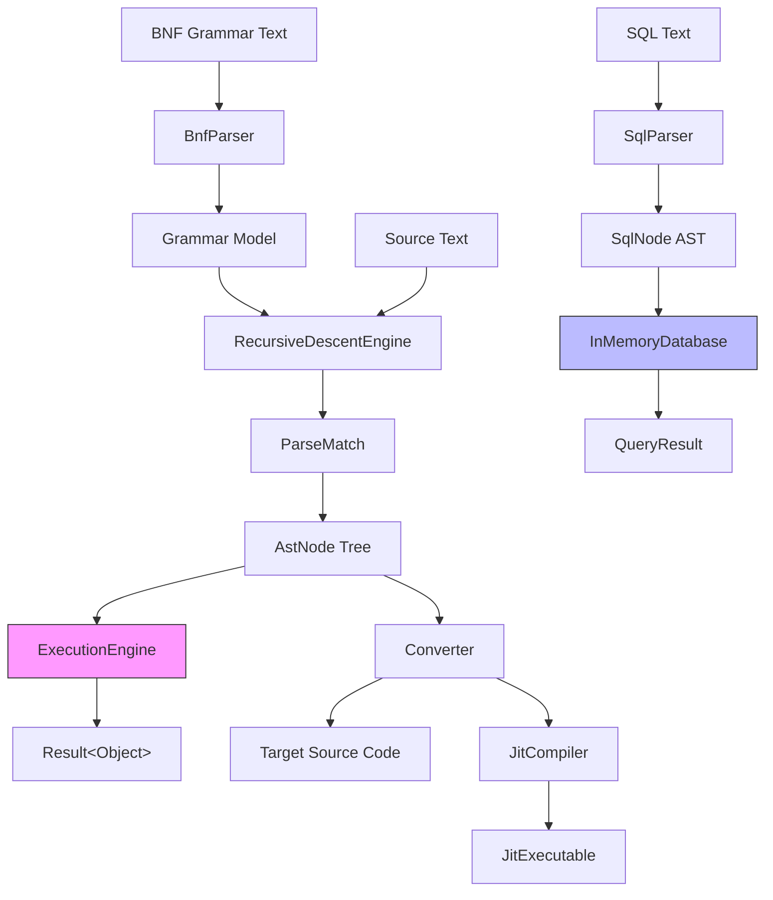
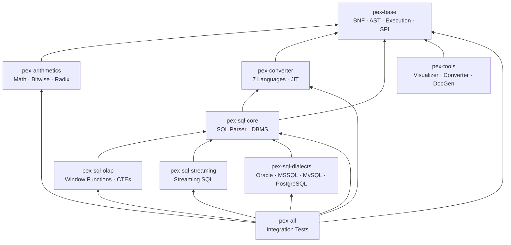
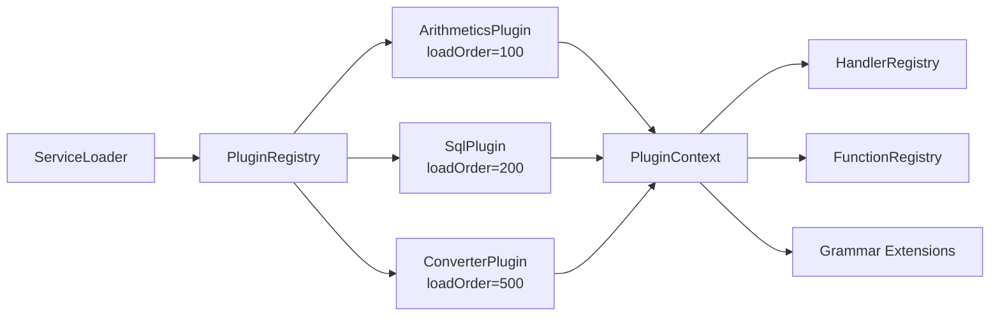
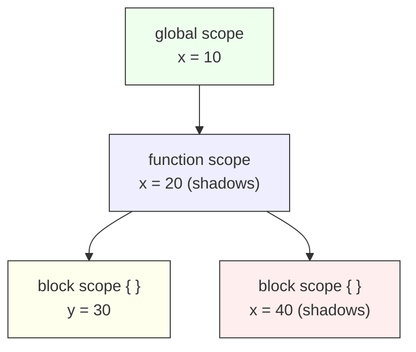
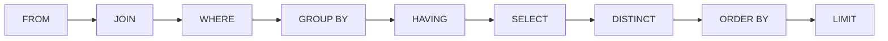

# PEX -- Parse and Execute

PEX is a modular Java 25 toolkit for defining grammars in BNF notation, parsing
input into abstract syntax trees, executing ASTs with scoped variables, and
converting them to other programming languages. It ships with a full arithmetic
expression evaluator, an in-memory SQL database simulator, and a JIT compilation
pipeline -- all wired together through a lightweight plugin SPI.

---

<a id="table-of-contents"></a>
## Table of Contents

- [Code Overview](#code-overview)
- [Features](#features)
- [Architecture](#architecture)
- [Module Layout](#module-layout)
- [Quick Start](#quick-start)
- [Usage](#usage)
  - [BNF Grammar Definition and Parsing](#bnf-grammar-definition-and-parsing)
  - [AST Construction and Execution](#ast-construction-and-execution)
  - [Scoped Variables](#scoped-variables)
  - [Arithmetic Expressions](#arithmetic-expressions)
  - [SQL Operations](#sql-operations)
  - [OLAP Operations](#olap-operations)
  - [Streaming SQL](#streaming-sql)
  - [Dialect Extensions](#dialect-extensions)
  - [NoSQL Simulation](#nosql-simulation)
  - [Code Conversion](#code-conversion)
  - [JIT Compilation](#jit-compilation)
  - [Plugin Development](#plugin-development)
- [Configuration Reference](#configuration-reference)
- [Error Handling](#error-handling)
- [Building and Running](#building-and-running)
- [Testing](#testing)
- [Project Structure](#project-structure)
- [Grammar Documentation](#grammar-documentation)
- [Release Procedure](#release-procedure)
- [Roadmap](#roadmap)
- [License](#license)
- [Authors](#authors)

---

<a id="code-overview"></a>
## Code Overview

For detailed design documentation — project goals, module decomposition rationale, key and secondary decisions, inconsistencies, and per-component test coverage — see [CODE_OVERVIEW.md](docs/CODE_OVERVIEW.md).

Per-module overviews:
- [pex-base/CODE_OVERVIEW.md](pex-base/doc/CODE_OVERVIEW.md)
- [pex-arithmetics/CODE_OVERVIEW.md](pex-arithmetics/doc/CODE_OVERVIEW.md)
- [pex-converter/CODE_OVERVIEW.md](pex-converter/doc/CODE_OVERVIEW.md)
- [pex-sql/CODE_OVERVIEW.md](pex-sql/doc/CODE_OVERVIEW.md) (parent)
  - [pex-sql/pex-sql-core/CODE_OVERVIEW.md](pex-sql/pex-sql-core/doc/CODE_OVERVIEW.md)
  - [pex-sql/pex-sql-olap/CODE_OVERVIEW.md](pex-sql/pex-sql-olap/doc/CODE_OVERVIEW.md)
  - [pex-sql/pex-sql-streaming/CODE_OVERVIEW.md](pex-sql/pex-sql-streaming/doc/CODE_OVERVIEW.md)
  - [pex-sql/pex-sql-dialects/CODE_OVERVIEW.md](pex-sql/pex-sql-dialects/doc/CODE_OVERVIEW.md)
- [pex-tools/CODE_OVERVIEW.md](pex-tools/doc/CODE_OVERVIEW.md)
- [pex-all/CODE_OVERVIEW.md](pex-all/doc/CODE_OVERVIEW.md)

---

<a id="features"></a>
## Features

### Core (pex-base)

- **BNF/EBNF grammar parser** -- define grammars with alternation, sequences,
  repetition, grouping, annotations, regex terminals, and comments
- **Recursive-descent engine** with packrat memoization and left-recursion
  detection
- **Sealed AST node hierarchy** -- `ProgramNode`, `LiteralNode`,
  `BinaryOpNode`, `FunctionCallNode`, `ConditionalNode`, `LoopNode`, and more
- **Hierarchical scope tree** with variable shadowing detection, immutability
  enforcement, and listener hooks
- **Execution engine** with pluggable node handlers, function registry, timeout
  guards, and execution statistics
- **Result\<T\> monad** -- `map`, `flatMap`, `recover`, `fold`, `zip`,
  `sequence`, and batch collection with no exceptions crossing API boundaries
- **Plugin SPI** -- `PexPlugin` + `ServiceLoader`-based auto-discovery

### Arithmetics (pex-arithmetics)

- Integer, float, bitwise, boolean, and comparison handlers
- 25+ math functions (`abs`, `sqrt`, `sin`, `pow`, `log2`, ...)
- Type conversion and radix functions (binary, octal, hex)
- Automatic numeric type promotion

### Converter (pex-converter)

- AST-to-source conversion for **Java, C#, C++, Kotlin, Scala, Ruby, BASIC**
- **JIT compilation** -- convert AST to Java source, compile in-memory, load and
  execute
- `ConverterRegistry` SPI with `ServiceLoader`-backed factory discovery

### SQL (pex-sql)

- Hand-written recursive-descent SQL parser producing a sealed `SqlNode` AST
- Full DML: SELECT (with joins, aggregations, subqueries, CASE, DISTINCT,
  ORDER BY, LIMIT/OFFSET), INSERT, UPDATE, DELETE
- Full DDL: CREATE/DROP/ALTER TABLE, CREATE INDEX, CREATE VIEW
- Transactions with savepoints (BEGIN, COMMIT, ROLLBACK, SAVEPOINT, RELEASE)
- Triggers and stored procedures
- In-memory DBMS simulator with schema, table, row, index, and view objects
- `InMemoryDatabase` supports a `protected` constructor for schema injection (enables external-store backends)
- Dialect support: ANSI SQL, MySQL, PostgreSQL

### OLAP (pex-sql-olap)

- **14 window functions**: ROW_NUMBER, RANK, DENSE_RANK, NTILE, LAG, LEAD,
  FIRST_VALUE, LAST_VALUE, NTH_VALUE, PERCENT_RANK, CUME_DIST,
  PERCENTILE_CONT, PERCENTILE_DISC, plus aggregate-over-window (SUM, COUNT,
  AVG, MIN, MAX)
- `OlapDatabase.executeOlap()` auto-detects `OVER` (window functions) and `ROLLUP`/`CUBE` in GROUP BY
- **Common Table Expressions** (recursive and non-recursive)
- **CUBE / ROLLUP / GROUPING SETS** for multi-dimensional aggregation
- **MERGE** (upsert) with WHEN MATCHED / WHEN NOT MATCHED clauses
- **PIVOT / UNPIVOT** for row-to-column and column-to-row transformations

### Streaming SQL (pex-sql-streaming)

- **CREATE STREAM** with schema and properties
- **Tumbling, hopping, sliding, and session windows**
- **Watermark-based** window closure with emit strategies (FINAL / CHANGES)
- Stream-to-stream and stream-to-table joins
- WHERE-clause filtering on stream events
- Windowed aggregate computation

### Dialect Extensions (pex-sql-dialects)

- **Oracle**: CONNECT BY, ROWNUM, NVL, DECODE, TO_CHAR, REGEXP_LIKE, and more
- **MSSQL**: TOP, CROSS APPLY, ISNULL, CONVERT, DATEDIFF, STUFF, FORMAT
- **MySQL**: REPLACE INTO, ON DUPLICATE KEY, IF, IFNULL, LOCATE, DATE_FORMAT
- **PostgreSQL**: ON CONFLICT (upsert), RETURNING, `::` type cast, ILIKE, DISTINCT
  ON, GENERATE_SERIES, ARRAY, DO blocks, 25+ functions (STRING_AGG, ARRAY_AGG,
  DATE_TRUNC, EXTRACT, MD5, INITCAP, CONCAT_WS, FORMAT, ...)
- **Special engines**: columnar (vectorized aggregation), time-series (SAMPLE BY,
  FILL), full-text (MATCH/AGAINST), spatial (ST_Distance, ST_Contains)
- **[docs/COMPLIANCE.md](docs/COMPLIANCE.md)** — SQL feature support matrix and dialect syntax differences across all 5 dialect variants, backed by `SqlFeatureComplianceTest` (117 tests)

### Grammar Files (EBNF)

- **26 EBNF grammar files** across all modules in `src/main/resources/grammar/` — SQL (DDL+DML+expressions+transactions, 4 SQL dialects, 5 OLAP/streaming files), NoSQL (query operators, CRUD ops, MongoDB DSL, CQL/Cassandra), base (expressions, literals, operators, functions, 4 arithmetic files)
- **GrammarLoader** utility for loading grammars from classpath or files
- Sub-domain splits: expressions, functions, literals, operators, arithmetic,
  bitwise, radix, math-functions, ddl, dml, sql-expressions, transactions,
  window-functions, cte, grouping-sets, merge, pivot, streaming, per-dialect
- **[HTML Grammar Documentation](docs/grammar/index.html)** -- Oracle SQL
  Reference-style railroad diagrams for every grammar rule (SVG, auto-generated)

---

<a id="architecture"></a>
## Architecture

### Main Pipeline



### Module Dependencies



### Plugin Architecture



### Scope Tree



### SQL Query Execution Order



---

<a id="module-layout"></a>
## Module Layout

| Module | Artifact | Description |
|--------|----------|-------------|
| **pex-base** | `ssg:pex-base` | BNF parsing, AST nodes, execution engine, scoping, Result monad, plugin SPI |
| **pex-arithmetics** | `ssg:pex-arithmetics` | Numeric handlers, math/conversion/radix functions, expression grammar |
| **pex-converter** | `ssg:pex-converter` | AST-to-source converters (7 languages), JIT compiler, converter SPI |
| **pex-sql** | `ssg:pex-sql` | Parent module for SQL sub-modules |
| -- **pex-sql-core** | `ssg:pex-sql-core` | SQL parser, in-memory DBMS simulator, dialect extensions |
| -- **pex-sql-olap** | `ssg:pex-sql-olap` | Window functions (14), CTEs, CUBE/ROLLUP, MERGE, PIVOT/UNPIVOT |
| -- **pex-sql-streaming** | `ssg:pex-sql-streaming` | Streaming SQL engine with tumbling/hopping/sliding/session windows |
| -- **pex-sql-dialects** | `ssg:pex-sql-dialects` | Oracle, MSSQL, MySQL, PostgreSQL dialects + columnar, time-series, full-text, spatial engines |
| **pex-nosql** | `ssg:pex-nosql` | Parent module for NoSQL sub-modules |
| -- **pex-nosql-core** | `ssg:pex-nosql-core` | In-memory NoSQL engine: Document store, `QueryEvaluator` (15 operators), `UpdateEvaluator` (7 operators), `AggregationEngine` (10 pipeline stages) |
| -- **pex-nosql-dialects** | `ssg:pex-nosql-dialects` | MongoDB fluent API (`MongoQuery`/`MongoUpdate`/`MongoPipeline`) + CQL/Cassandra string dialect |
| **pex-tools** | `ssg:pex-tools` | Railroad diagram visualizer (BNF + native ANTLR4), BNF↔ANTLR converter, grammar documentation generator |
| **pex-all** | `ssg:pex-all` | Cross-module integration tests |

### Build system

PEX supports both Maven and Gradle. The root aggregator builds all modules:

```
pex/                        (root aggregator)
  pom.xml                   Maven parent POM
  build.gradle.kts          Gradle root build
  settings.gradle.kts       Gradle module inclusion
```

---

<a id="quick-start"></a>
## Quick Start

### Maven

```xml
<dependency>
    <groupId>ssg</groupId>
    <artifactId>pex-base</artifactId>
    <version>0.2.0-SNAPSHOT</version>
</dependency>

<!-- Add domain modules as needed -->
<dependency>
    <groupId>ssg</groupId>
    <artifactId>pex-arithmetics</artifactId>
    <version>0.2.0-SNAPSHOT</version>
</dependency>
<dependency>
    <groupId>ssg</groupId>
    <artifactId>pex-sql-core</artifactId>
    <version>0.2.0-SNAPSHOT</version>
</dependency>
<dependency>
    <groupId>ssg</groupId>
    <artifactId>pex-converter</artifactId>
    <version>0.2.0-SNAPSHOT</version>
</dependency>
```

### Gradle (Kotlin DSL)

```kotlin
dependencies {
    implementation("ssg:pex-base:0.2.0-SNAPSHOT")
    implementation("ssg:pex-arithmetics:0.2.0-SNAPSHOT")
    implementation("ssg:pex-sql-core:0.2.0-SNAPSHOT")
    implementation("ssg:pex-converter:0.2.0-SNAPSHOT")
}
```

> **Note:** Java 25 with `--enable-preview` is required. Both the Maven
> `surefire` plugin and Gradle `Test` tasks are already configured for this.

---

<a id="usage"></a>
## Usage

<a id="bnf-grammar-definition-and-parsing"></a>
### BNF Grammar Definition and Parsing

Define a grammar in EBNF text and parse it into a `Grammar` model:

```java
import ssg.pex.bnf.parser.BnfParser;

var parser = new BnfParser();
Result<Grammar> result = parser.parse("""
    grammar expr;
    expr    ::= term (( '+' | '-' ) term)* ;
    term    ::= factor (( '*' | '/' ) factor)* ;
    factor  ::= /[0-9]+/ | '(' expr ')' ;
    """);

Grammar grammar = result.value();
// Grammar{name='expr', rules=3, start='expr'}
```

Use the grammar to parse input text:

```java
import ssg.pex.bnf.engine.RecursiveDescentEngine;

var engine = new RecursiveDescentEngine();
Result<ParseMatch> match = engine.parse("3 + 5 * (2 - 1)", grammar);
// Traversable parse tree with named rule matches
```

<a id="ast-construction-and-execution"></a>
### AST Construction and Execution

Build an AST and execute it with the `ExecutionEngine`:

```java
import ssg.pex.ast.node.*;
import ssg.pex.exec.ExecutionEngine;

var ast = new BinaryOpNode(
    new LiteralNode(10, loc),
    Operator.PLUS,
    new LiteralNode(20, loc),
    loc
);

try (var engine = ExecutionEngine.builder()
        .loadPlugins()       // auto-discover via ServiceLoader
        .build()) {
    Result<Object> result = engine.execute(ast);
    System.out.println(result.value()); // 30
}
```

<a id="scoped-variables"></a>
### Scoped Variables

The `ScopeTree` manages hierarchical variable scopes with shadowing detection:

```java
import ssg.pex.scope.*;

var tree = new ScopeTree();

// Define in global scope
tree.defineVariable("x", new ScalarVariable("x", 42, true));

// Enter a nested scope
tree.enterScope("inner");
tree.defineVariable("y", new ScalarVariable("y", 99, true));

// Resolve walks up the scope chain
tree.resolveVariable("x"); // Result.success(Variable{x=42})
tree.resolveVariable("z"); // Result.failure("UNDEFINED_VARIABLE", ...)

// Shadow detection is automatic
tree.defineVariable("x", new ScalarVariable("x", 0, true));
tree.shadowHistory(); // [ShadowRecord{name=x, ...}]

tree.exitScope();
```

<a id="arithmetic-expressions"></a>
### Arithmetic Expressions

With `pex-arithmetics` on the classpath, the plugin registers handlers and
functions automatically:

```java
try (var engine = ExecutionEngine.builder()
        .plugin(new ArithmeticsPlugin())
        .build()) {

    // Binary arithmetic
    engine.execute(new BinaryOpNode(lit(7), Operator.MULTIPLY, lit(6), loc));
    // -> 42

    // Math functions are available in the function registry
    engine.functions().call("sqrt", List.of(144.0), ctx);
    // -> 12.0

    engine.functions().call("pow", List.of(2.0, 10.0), ctx);
    // -> 1024.0
}
```

<a id="sql-operations"></a>
### SQL Operations

Parse and execute SQL against the in-memory database:

```java
import ssg.pex.sql.dbms.InMemoryDatabase;

try (var db = new InMemoryDatabase()) {
    // DDL
    db.execute("""
        CREATE TABLE users (
            id    INTEGER PRIMARY KEY AUTO_INCREMENT,
            name  VARCHAR(100) NOT NULL,
            email VARCHAR(255) UNIQUE
        )
        """);

    // DML -- insert
    db.execute("INSERT INTO users (name, email) VALUES ('Alice', 'alice@example.com')");
    db.execute("INSERT INTO users (name, email) VALUES ('Bob', 'bob@example.com')");

    // DML -- select with WHERE
    Result<Object> result = db.execute(
        "SELECT name, email FROM users WHERE name = 'Alice'");

    // Transactions
    db.execute("BEGIN");
    db.execute("UPDATE users SET email = 'a@new.com' WHERE name = 'Alice'");
    db.execute("SAVEPOINT sp1");
    db.execute("DELETE FROM users WHERE name = 'Bob'");
    db.execute("ROLLBACK TO SAVEPOINT sp1");
    db.execute("COMMIT");

    // Batch insert — parse template once, stream rows lazily (no list buffering)
    int inserted = db.executeBatch(
        "INSERT INTO users (name, email) VALUES (?, ?)",
        java.util.stream.IntStream.range(0, 10_000)
            .mapToObj(i -> new Object[]{"user" + i, "u" + i + "@ex.com"})
    );
    // Backward-compatible List overload also works:
    // db.executeBatch(template, List<Object[]> rows);
}
```

<a id="olap-operations"></a>
### OLAP Operations

Use `pex-sql-olap` for window functions, CTEs, and advanced analytics:

```java
import ssg.pex.sql.olap.OlapDatabase;

try (var db = new OlapDatabase()) {
    db.execute("CREATE TABLE sales (id INT, region VARCHAR(20), amount INT)");
    db.execute("INSERT INTO sales VALUES (1, 'East', 100)");
    db.execute("INSERT INTO sales VALUES (2, 'East', 200)");
    db.execute("INSERT INTO sales VALUES (3, 'West', 150)");

    // Window function: running total per region
    var wf = db.parseWindowFunction("SUM(amount) OVER (PARTITION BY region ORDER BY id)");
    var result = db.executeWindowFunction(
        "SELECT id, region, amount FROM sales", List.of(wf));

    // CTE query
    var cteResult = db.executeOlap("""
        WITH regional_totals AS (
            SELECT region, SUM(amount) AS total FROM sales GROUP BY region
        )
        SELECT * FROM regional_totals
        """);
}
```

<a id="streaming-sql"></a>
### Streaming SQL

Use `pex-sql-streaming` for event stream processing with windows:

```java
import ssg.pex.sql.streaming.engine.StreamSimulator;
import ssg.pex.sql.streaming.engine.StreamEvent;

var sim = new StreamSimulator();

// Create a stream
sim.executeQuery("CREATE STREAM clicks (user_id VARCHAR(50), page VARCHAR(100), ts BIGINT)");

// Ingest events
sim.ingestEvent("clicks", new StreamEvent(1000L, "u1", Map.of("user_id", "u1", "page", "/home")));
sim.ingestEvent("clicks", new StreamEvent(2000L, "u2", Map.of("user_id", "u2", "page", "/home")));

// Query with tumbling window
var result = sim.executeQuery(
    "SELECT page, COUNT(*) AS cnt FROM clicks WINDOW TUMBLING SIZE 5000 GROUP BY page EMIT FINAL");
```

<a id="dialect-extensions"></a>
### Dialect Extensions

Use `pex-sql-dialects` for vendor-specific SQL features:

```java
import ssg.pex.sql.dialects.DialectDatabase;
import ssg.pex.sql.dialects.DialectDatabase.DialectType;

// Oracle mode
try (var oracle = new DialectDatabase(new InMemoryDatabase(), DialectType.ORACLE)) {
    oracle.execute("CREATE TABLE emp (id INT, name VARCHAR(50), mgr_id INT)");
    oracle.execute("SELECT * FROM emp CONNECT BY PRIOR id = mgr_id START WITH mgr_id IS NULL");
}

// PostgreSQL mode
try (var pg = new DialectDatabase(new InMemoryDatabase(), DialectType.POSTGRESQL)) {
    pg.execute("CREATE TABLE products (id INT PRIMARY KEY, name VARCHAR(100), price DOUBLE)");
    pg.execute("INSERT INTO products VALUES (1, 'Widget', 9.99)");
    // ON CONFLICT upsert
    pg.execute("INSERT INTO products VALUES (1, 'Widget', 12.99) ON CONFLICT (id) DO UPDATE SET price = 12.99");
    // Type cast, ILIKE, PostgreSQL functions
    pg.execute("SELECT name, price::INT FROM products WHERE name ILIKE '%widget%'");
}

// Full-text search
try (var ftDb = new DialectDatabase(new InMemoryDatabase(), DialectType.FULLTEXT)) {
    ftDb.execute("CREATE TABLE docs (id INT, body TEXT)");
    ftDb.execute("SELECT * FROM docs WHERE MATCH(body) AGAINST('search terms')");
}
```

<a id="nosql-simulation"></a>
### NoSQL Simulation

Use `pex-nosql-core` for an in-memory document store:

```java
import ssg.pex.nosql.Document;
import ssg.pex.nosql.InMemoryNoSqlDatabase;

var db = new InMemoryNoSqlDatabase();
var col = db.getCollection("users");

// CRUD
col.insertOne(Document.of("name", "Alice", "age", 30, "dept", "Engineering"));
col.insertMany(List.of(
    Document.of("name", "Bob",   "age", 25, "dept", "Sales"),
    Document.of("name", "Carol", "age", 35, "dept", "Engineering")
));

// Query with operators
var result = col.find(Document.of("age", Document.of("$gt", 25))).toList();

// Update
col.updateMany(Document.of("dept", "Engineering"),
               Document.of("$set", Document.of("level", "senior")));

// Aggregation pipeline
var stats = col.aggregate(List.of(
    Document.of("$match", Document.of("dept", "Engineering")),
    Document.of("$group", Document.of("_id", "$dept",
                                       "avg", Document.of("$avg", "$age")))
)).toList();
```

Use `pex-nosql-dialects` for MongoDB fluent API:

```java
import ssg.pex.nosql.dialects.mongodb.MongoDbDatabase;
import ssg.pex.nosql.dialects.mongodb.MongoQuery;
import ssg.pex.nosql.dialects.mongodb.MongoUpdate;

var mongo = new MongoDbDatabase();
var users = mongo.getMongoCollection("users");

users.insertOne(Document.of("name", "Bob", "dept", "Eng", "score", 88));
var found   = users.find(MongoQuery.eq("dept", "Eng")).toList();
var seniors = users.find(MongoQuery.and(MongoQuery.eq("dept", "Eng"),
                                        MongoQuery.gte("score", 80))).toList();
users.updateMany(MongoQuery.eq("dept", "Eng"), MongoUpdate.inc("score", 5));
```

Use `pex-nosql-dialects` for CQL/Cassandra:

```java
import ssg.pex.nosql.dialects.cassandra.CassandraDatabase;

var cass = new CassandraDatabase();
var session = cass.connect("inventory");

session.execute("CREATE TABLE products (id INT PRIMARY KEY, name TEXT, price DOUBLE)");
session.execute("INSERT INTO products (id, name, price) VALUES (1, 'Widget', 9.99)");
var rs = session.execute("SELECT * FROM products WHERE price < 15.0 ALLOW FILTERING");
var row = rs.one();
```

<a id="code-conversion"></a>
### Code Conversion

Convert an AST to different programming languages:

```java
import ssg.pex.converter.spi.ConverterRegistry;
import ssg.pex.converter.TargetLanguage;

var registry = ConverterRegistry.getInstance();

// Convert to Java
var javaConverter = registry.getConverter(TargetLanguage.JAVA).orElseThrow();
Result<String> javaCode = javaConverter.convert(ast);

// Convert to Kotlin
var kotlinConverter = registry.getConverter(TargetLanguage.KOTLIN).orElseThrow();
Result<String> kotlinCode = kotlinConverter.convert(ast);

// Available targets: JAVA, CSHARP, CPP, KOTLIN, SCALA, RUBY, BASIC, JIT
Set<TargetLanguage> targets = registry.availableTargets();
```

<a id="jit-compilation"></a>
### JIT Compilation

Convert an AST to Java, compile in-memory, and execute -- all without touching
the filesystem:

```java
import ssg.pex.converter.jit.JitCompiler;

// 1. Convert AST to Java source
var converter = registry.getConverter(TargetLanguage.JAVA).orElseThrow();
String javaSource = converter.convert(ast).value();

// 2. Compile in-memory
var jit = new JitCompiler();
Result<JitCompilationResult> compiled = jit.compile(javaSource, "GeneratedExpr");

// 3. Execute
JitExecutable executable = compiled.value().executable();
Object result = executable.execute();
```

<a id="plugin-development"></a>
### Plugin Development

Create a custom plugin by implementing `PexPlugin`:

```java
public class MyPlugin implements PexPlugin {

    @Override
    public String name() { return "my-plugin"; }

    @Override
    public int loadOrder() { return 500; }  // lower = earlier

    @Override
    public void initialize(PluginContext ctx) {
        // Register node handlers
        ctx.registerHandler(MyNode.class, (node, execCtx) -> {
            // handle the node
            return Result.success(computedValue);
        });

        // Register functions
        ctx.registerFunction("myFunc", List.of("a", "b"), (args, execCtx) -> {
            return Result.success(args.get(0).toString() + args.get(1).toString());
        });

        // Optionally provide or extend a grammar
        ctx.setGrammar(myGrammar);
    }
}
```

Register via `META-INF/services/ssg.pex.spi.PexPlugin`:

```
com.example.MyPlugin
```

Or manually:

```java
ExecutionEngine.builder()
    .plugin(new MyPlugin())
    .build();
```

---

<a id="configuration-reference"></a>
## Configuration Reference

`ExecutionConfig` is a record with these fields:

| Field | Type | Default | Description |
|-------|------|---------|-------------|
| `maxRecursionDepth` | `int` | `256` | Maximum AST evaluation recursion depth |
| `maxLoopIterations` | `int` | `100_000` | Guard against infinite loops |
| `timeoutMillis` | `long` | `30_000` | Execution timeout in milliseconds |
| `errorMode` | `ErrorMode` | `RESULT` | `RESULT` wraps errors in `Result.failure()`; `EXCEPTION` throws |

```java
var config = new ExecutionConfig(512, 200_000, 60_000L, ErrorMode.RESULT);

ExecutionEngine.builder()
    .config(config)
    .loadPlugins()
    .build();
```

---

<a id="error-handling"></a>
## Error Handling

PEX uses `Result<T>`, a sealed interface with two implementations: `Success<T>`
and `Failure<T>`. No exceptions escape the public API surface (unless
`ErrorMode.EXCEPTION` is configured).

```java
Result<Grammar> parsed = new BnfParser().parse(source);

// Pattern matching
switch (parsed) {
    case Success<Grammar> s -> System.out.println(s.value());
    case Failure<Grammar> f -> System.err.println(f.error().message());
}

// Monadic chaining
parsed
    .map(Grammar::startRule)
    .flatMap(rule -> engine.parse(input, grammar))
    .peek(match -> log.info("Parsed: {}", match))
    .peekError(err -> log.error("Failed: {}", err));

// Recovery
parsed.recover(err -> fallbackGrammar);
parsed.recoverWith(err -> loadGrammarFromFile(path));

// Folding
String message = parsed.fold(
    grammar -> "Loaded " + grammar.rules().size() + " rules",
    error   -> "Error: " + error.message()
);

// Combining results
Result<List<Grammar>> all = Result.sequence(List.of(g1, g2, g3));
Result<Result.Pair<Grammar, AstNode>> pair = Result.zip(grammarResult, astResult);

// Batch collection (collect both successes and errors)
BatchResult<Grammar> batch = Result.collect(results);
batch.successes();  // List<Grammar>
batch.errors();     // List<PexError>
```

---

<a id="building-and-running"></a>
## Building and Running

### Prerequisites

- **JDK 25** (preview features enabled)
- **Maven 3.9+** or **Gradle 9.6+**

### Maven

```bash
# Full build with tests
mvn clean verify

# Skip tests
mvn clean package -DskipTests

# Run a single module's tests
mvn test -pl pex-base
```

### Gradle

```bash
# Full build with tests
./gradlew build

# Skip tests
./gradlew build -x test

# Run a single module's tests
./gradlew :pex-base:test
```

Both build systems pass `--enable-preview` to `javac` and the JVM, and run
tests sequentially (parallel execution disabled for reliability).

---

<a id="testing"></a>
## Testing

| Module | Tests | Focus |
|--------|------:|-------|
| pex-base | 643 | Result monad, BNF parser, grammar model, recursive-descent engine, AST nodes, scope tree, execution engine, SPI, GrammarLoader, real-world complex tests |
| pex-arithmetics | 288 | Integer/float handlers, bitwise/boolean/comparison ops, math/conversion/radix functions, type promotion, IEEE 754, real-world calculations |
| pex-converter | 218 | Java/C#/C++/Kotlin/Scala/Ruby/BASIC converters, JIT compilation, converter registry, complex programs |
| pex-sql-core | 509 | SQL parser (all statement types), in-memory DBMS (CRUD, joins, aggregations, transactions, triggers, procedures), nested subqueries, aliases, complex WHERE, stored procedures, views; hash-join, LRU parse cache, executeBatch(Stream), partial push-down |
| pex-sql-olap | 187 | Window functions (14), CTEs (recursive/non-recursive), CUBE/ROLLUP/GROUPING SETS, MERGE, PIVOT/UNPIVOT, real-world analytics |
| pex-sql-streaming | 175 | Stream lifecycle, tumbling/hopping/sliding/session windows, watermarks, emit strategies, stream joins, aggregation, IoT/clickstream/financial scenarios |
| pex-sql-dialects | 273 | Oracle/MSSQL/MySQL/PostgreSQL parsers and functions, columnar, time-series, full-text, spatial engines, real-world dialect tests |
| pex-tools | 221 | Railroad diagram renderer (BNF + native ANTLR4), SVG/PNG exporters, BNF↔ANTLR converter, native ANTLR parser, grammar doc generator, Swing visualizer app |
| pex-nosql-core | 198 | In-memory NoSQL engine, query evaluator (15 operators), update evaluator (7 operators), aggregation pipeline (10 stages), NoSQL plugin SPI |
| pex-nosql-dialects | 185 | MongoDB fluent API (MongoQuery/MongoUpdate/MongoPipeline), CQL/Cassandra dialect, dialect-specific operations |
| pex-all | 118 | Cross-module plugin loading, end-to-end pipelines, JIT round-trip, SQL sub-module integration, cross-dialect tests |
| **Total** | **3,015** | |

Testing stack: **JUnit 5.11**, **Mockito 5.14**, **AssertJ 3.27**.

---

<a id="project-structure"></a>
## Project Structure

```
pex/
  pom.xml
  build.gradle.kts
  settings.gradle.kts
  README.md
  pex-base/
    build.gradle.kts
    README.md
    src/main/java/ssg/pex/
      result/          Result<T>, Success, Failure, PexError, BatchResult
      bnf/
        model/         Grammar, Rule, RuleExpression, Alternation, Sequence, ...
        parser/        BnfParser
        engine/        RecursiveDescentEngine, ParseMatch, ParseContext
        dialect/       DialectExtension, RuleAddition, RuleReplacement, ...
      ast/
        node/          AstNode (sealed), LiteralNode, BinaryOpNode, ...
        SourceLocation
      scope/           ScopeTree, Scope, Variable, ScalarVariable, ScopeTracer
      exec/            ExecutionEngine, ExecutionContext, ExecutionConfig,
                       HandlerRegistry, FunctionRegistry, NodeHandler
      spi/             PexPlugin, PluginContext, PluginRegistry
      type/            PexType, TypeCoercion, TypeDescriptor
      util/            Preconditions
  pex-arithmetics/
    build.gradle.kts
    README.md
    src/main/java/ssg/pex/arithmetics/
      ArithmeticsPlugin
      handler/         IntArithmeticHandler, FloatArithmeticHandler,
                       BitwiseHandler, BooleanHandler, ComparisonHandler, RadixHandler
      function/        MathFunctions, ConversionFunctions, RadixFunctions
      grammar/         ArithmeticsGrammarProvider
  pex-converter/
    build.gradle.kts
    README.md
    src/main/java/ssg/pex/converter/
      Converter, TargetLanguage, ConversionConfig
      lang/            AbstractConverter, JavaConverter, CSharpConverter,
                       CppConverter, KotlinConverter, ScalaConverter,
                       RubyConverter, BasicConverter
      jit/             JitCompiler, JitExecutable, JitCompilationResult
      mapping/         TypeMapper, OperatorMapper
      spi/             ConverterFactory, ConverterRegistry
  pex-sql/                     (parent POM for SQL sub-modules)
    README.md
    pex-sql-core/
      build.gradle.kts
      README.md
      src/main/java/ssg/pex/sql/
        SqlPlugin
        grammar/         SqlParser, SqlTokenizer, SqlDialects
        ast/             SqlNode (sealed), SelectNode, InsertNode, UpdateNode,
                         DeleteNode, CreateTableNode, DropTableNode, AlterTableNode,
                         CreateIndexNode, CreateViewNode, CreateTriggerNode,
                         CreateProcedureNode, TransactionNode, CallNode,
                         SqlExpression, SqlSupport
        handler/         SqlNodeHandler
        function/        SqlFunctions
        dbms/
          InMemoryDatabase, Schema, Table, Row, Column, Index, View, Trigger,
          StoredProcedure
          executor/      QueryExecutor, DmlExecutor, DdlExecutor, JoinEngine,
                         AggregateEngine, SortEngine, ExpressionEvaluator
          result/        QueryResult, DmlResult
          transaction/   TransactionManager, Transaction, IsolationLevel, ChangeLog
    pex-sql-olap/
      README.md
      src/main/java/ssg/pex/sql/olap/
        OlapDatabase, OlapPlugin
        ast/             WindowFunctionCall, OverClause, FrameSpec, WithClause,
                         CteDefinition, GroupingSetSpec, MergeNode, PivotClause
        parser/          OlapSqlParser
        executor/        WindowFunctionExecutor, CteExecutor, GroupingSetExecutor,
                         MergeExecutor, PivotExecutor
    pex-sql-streaming/
      README.md
      src/main/java/ssg/pex/sql/streaming/
        StreamingPlugin
        ast/             StreamNode (sealed), CreateStreamNode, StreamSelectNode,
                         WindowSpec, EmitStrategy
        engine/          StreamSimulator, StreamSource, StreamEvent, WindowManager,
                         TumblingWindow, HoppingWindow, SlidingWindow, SessionWindow,
                         Watermark, StreamSqlParser, StreamAggregator
    pex-sql-dialects/
      README.md
      src/main/java/ssg/pex/sql/dialects/
        DialectDatabase, DialectFunctionRegistry, DialectsPlugin
        oracle/          OracleParser, OracleExecutor, OracleFunctions, OracleNodes
        mssql/           MssqlParser, MssqlExecutor, MssqlFunctions, MssqlNodes
        mysql/           MysqlParser, MysqlExecutor, MysqlFunctions, MysqlNodes
        postgresql/      PostgresqlParser, PostgresqlExecutor, PostgresqlFunctions, PostgresqlNodes
        engines/         ColumnarEngine, TimeSeriesEngine, FullTextEngine, SpatialEngine
  pex-tools/
    build.gradle.kts
    src/main/java/ssg/pex/tools/
      visualizer/        RailroadDiagramRenderer, AntlrDiagramRenderer,
                         SvgExporter, PngExporter, MultiRulePanel,
                         AntlrMultiRulePanel, GrammarVisualizerApp, DiagramStyle
      converter/         BnfToAntlrConverter, AntlrToBnfConverter, Antlr4Lexer
      converter/antlr/   AntlrExpression, AntlrRule, AntlrGrammar, AntlrGrammarParser
      docgen/            GrammarDocGenerator, MarkdownDiagramGenerator
  pex-all/
    build.gradle.kts
    README.md
    src/test/java/     Cross-module integration tests
  docs/
    grammar/             22 HTML files with SVG railroad diagrams
      index.html         Grammar documentation index page
  costs/
    BUILD_COST_REPORT.md Agent token usage and cost tracking
```

---

<a id="grammar-documentation"></a>
## Grammar Documentation

PEX includes auto-generated HTML grammar documentation with **railroad diagrams**
(Oracle SQL Reference style) for every grammar rule across all modules:

| Module | Grammar Files | Rules | HTML Documentation |
|--------|--------------|------:|-------------------|
| pex-base | expressions, functions, literals, operators | 49 | [View](docs/grammar/base-expressions.html) |
| pex-arithmetics | arithmetic, bitwise, radix, math-functions | 49 | [View](docs/grammar/arithmetic.html) |
| pex-sql-core | ddl, dml, sql-expressions, transactions | 129 | [View](docs/grammar/sql-ddl.html) |
| pex-sql-olap | window-functions, cte, grouping-sets, merge, pivot | 83 | [View](docs/grammar/olap-window-functions.html) |
| pex-sql-streaming | streaming | 35 | [View](docs/grammar/streaming.html) |
| pex-sql-dialects | oracle, mssql, mysql, postgresql | 97 | [View](docs/grammar/dialect-oracle.html) |
| pex-nosql-core | nosql-query, nosql-operations | 28 | [View](docs/grammar/nosql-query.html) |
| pex-nosql-dialects | mongodb, cassandra | 45 | [View](docs/grammar/nosql-mongodb.html) |
| **Total** | **26 files** | **535** | [**Index**](docs/grammar/index.html) |

Each HTML page contains:
- Table of contents with all rules
- SVG railroad diagram per rule (inline, no external images)
- BNF notation for each production
- Cross-linked NonTerminal references

Generated using `GrammarDocGenerator` from the `pex-tools` module.

### ANTLR4 Grammar Collection

A collection of 12 ANTLR4 (`.g4`) grammar files is available under `grammar/antlr/`, demonstrating the visualizer's native ANTLR support:

| Category | Grammar | ANTLR Features |
|----------|---------|----------------|
| PEX | PexExpressions, PexLiterals, SqlDml, SqlDdl | Labeled alternatives, fragments |
| JSON | JSON.g4 | Fragments, `-> skip` |
| XML | XML.g4 | Lexer modes, `pushMode`/`popMode` |
| Calculator | Calculator.g4 | `# AltLabel`, `label=expr`, predicates |
| SQL | SimpleSQL.g4 | Complex alternation, keywords |
| DOT | DOT.g4 | Graph description language |
| URL | URL.g4 | Fragment rules, character classes |
| Markdown | SimpleMarkdown.g4 | `-> channel(HIDDEN)` |
| CSV | CSV.g4 | Parser/lexer separation |

Open `.g4` files in the Grammar Visualizer to see all ANTLR constructs rendered as railroad diagrams, with ANTLR-specific features (predicates, actions, negation, labels) shown in grey/muted tones.

---

<a id="roadmap"></a>
## Roadmap
---

<a id="release-procedure"></a>
## Release Procedure

For the complete step-by-step release guide, see [doc/RELEASE_PROCEDURE.md](doc/RELEASE_PROCEDURE.md).


- [ ] Automatic AST building from ParseMatch (bridge BNF parse output to AstNode)
- [ ] REPL / interactive shell
- [ ] Language Server Protocol (LSP) support for grammar editing
- [ ] TypeScript and Python converter backends
- [ ] Persistent storage adapter for the SQL module
- [ ] Parallel query execution in InMemoryDatabase
- [ ] Grammar composition (import one grammar into another)
- [ ] Debug/trace mode with step-through execution
- [ ] GraalVM native-image support

---

<a id="license"></a>
## License

This project is licensed under the **MIT License**.

---

<a id="authors"></a>
## Authors

- **Sergey Sidorov** -- architecture, implementation, and tests
