# PEX — Build Cost & Effort Report

> Generated from Claude Code session data. Token counts are from background agent
> notifications only — the orchestrating agent's own token usage is **not tracked**
> in these figures (see [Limitations](#limitations) below).

---

## Executive Summary

| Metric | Value |
|--------|-------|
| Total background agent token usage (tracked) | ~3,082,000 tokens |
| Total background agent tool calls | ~1,882 |
| Total background agent wall time | ~230 minutes |
| Total commits | 19 |
| Total files created/modified | 495+ |
| Total lines of code/docs/tests | ~63,200 |
| Total tests passing | 2,760 |
| Orchestrator token usage | Not tracked (see Limitations) |

---

## Task Execution Sequence

```mermaid
sequenceDiagram
    participant O as Orchestrator
    participant A1 as Agent Pool 1
    participant A2 as Agent Pool 2
    participant A3 as Agent Pool 3
    participant A4 as Agent Pool 4

    Note over O: Phase 1 — Architecture Exploration
    O->>A1: Explore rvfs project patterns
    A1-->>O: (exploration complete)
    O->>A1: Design pex architecture (Plan agent)
    A1-->>O: 62KB plan output

    Note over O: Phase 2 — Scaffolding
    O->>O: Maven multi-module setup (direct)
    O->>O: Commit: 099768d scaffolding

    Note over O,A3: Phase 3 — pex-base Implementation (parallel)
    O->>A1: BNF model + dialect
    O->>A2: AST nodes + visitor
    O->>A3: Type + scope + execution
    A1-->>O: 52K tokens, 54 tools, 400s
    A2-->>O: 39K tokens, 40 tools, 222s
    A3-->>O: 81K tokens, 90 tools, 457s

    Note over O,A2: Phase 4 — pex-base Tests (parallel)
    O->>A1: Result + BNF + parser tests
    O->>A2: AST + scope + execution tests
    A1-->>O: 76K tokens, 44 tools, 1474s
    A2-->>O: 93K tokens, 32 tools, 426s

    Note over O,A3: Phase 5 — Modules (parallel)
    O->>A1: pex-arithmetics
    O->>A2: pex-converter
    O->>A3: pex-sql
    A1-->>O: 87K tokens, 81 tools, 547s
    A2-->>O: 89K tokens, 100 tools, 584s
    A3-->>O: 155K tokens, 129 tools, 1377s

    Note over O: Phase 6 — Integration Tests
    O->>A1: pex-all integration tests
    A1-->>O: 143K tokens, 105 tools, 735s

    Note over O: Phase 7 — Commit 8bddbb8
    O->>O: Build verification + commit

    Note over O: Phase 8 — Gradle Build
    O->>O: Gradle setup (direct)
    O->>O: Commit: 4ed9fc9

    Note over O,A4: Phase 9 — Documentation (parallel)
    O->>A1: CLAUDE.md
    O->>A2: REQUIREMENTS.md
    O->>A3: 6 README files
    O->>A4: Pex.java demo
    A1-->>O: 43K tokens, 24 tools, 182s
    A2-->>O: 59K tokens, 26 tools, 231s
    A3-->>O: 87K tokens, 41 tools, 322s
    A4-->>O: 108K tokens, 90 tools, 525s

    Note over O: Phase 10 — Commit 0e60dec

    Note over O,A4: Phase 11 — Diagrams + Complex Tests (parallel)
    O->>A1: Mermaid diagrams
    O->>A2: Complex SQL tests
    O->>A3: Complex base + arithmetic tests
    O->>A4: Complex converter + integration tests
    A1-->>O: 51K tokens, 15 tools, 123s
    A2-->>O: 155K tokens, 62 tools, 659s
    A3-->>O: 133K tokens, 55 tools, 412s
    A4-->>O: 108K tokens, 74 tools, 436s

    Note over O: Phase 12 — Commit 48e2955

    Note over O: Phase 13 — SQL Sub-Module Restructure
    O->>O: Restructure pex-sql → parent + core (direct)

    Note over O,A3: Phase 14 — SQL Sub-Modules (parallel)
    O->>A1: pex-sql-olap
    O->>A2: pex-sql-streaming
    O->>A3: pex-sql-dialects
    A1-->>O: 128K tokens, 54 tools, 628s
    A2-->>O: 108K tokens, 47 tools, 530s
    A3-->>O: 147K tokens, 62 tools, 773s

    Note over O,A3: Phase 15 — Fix Agents (parallel)
    O->>A1: Fix streaming tests
    O->>A2: Fix OLAP tests (failed bash)
    O->>A3: Fix dialects tests (failed bash)
    A1-->>O: 86K tokens, 37 tools, 295s
    A2-->>O: 81K tokens, 12 tools, 34s
    A3-->>O: 81K tokens, 18 tools, 53s

    Note over O: Phase 16 — Manual Fixes + Commit 6f5cb01

    Note over O: Phase 17 — Docs + Cost Report
    O->>A1: SQL sub-module docs + integration tests
    A1-->>O: 131K tokens, 66 tools, 479s

    Note over O: Phase 18 — Commit 04adc07

    Note over O,A3: Phase 19 — PostgreSQL + pex-tools + Complex Tests (parallel)
    O->>A1: Railroad diagram visualizer
    O->>A2: BNF↔ANTLR converter + docgen
    O->>A3: Complex SQL module tests
    A1-->>O: 65K tokens, 35 tools, 330s
    A2-->>O: 74K tokens, 37 tools, 355s
    A3-->>O: 121K tokens, 43 tools, 628s

    Note over O: Phase 20 — Orchestrator fixes + Commit 1654aff

    Note over O: Phase 21 — Grammar Doc Generation
    O->>A1: HTML grammar docs (22 files)
    A1-->>O: 63K tokens, 55 tools, 338s

    Note over O: Phase 22 — Final docs + Commit 9

    Note over O,A4: Phase 23 — Regex-to-Grammar (parallel)
    O->>A1: SQL core grammars
    O->>A2: SQL OLAP grammars
    O->>A3: Dialect + streaming grammars
    O->>A4: Math-functions grammar
    A1-->>O: 31K tokens, 7 tools, 41s
    A2-->>O: 29K tokens, 8 tools, 33s
    A3-->>O: 39K tokens, 19 tools, 68s
    A4-->>O: 26K tokens, 2 tools, 14s

    Note over O: Phase 24 — Verify + Regenerate docs + Commit 10
```



---

## Background Agent Usage by Task

### Commit 2: Full PEX Implementation (`8bddbb8`)

| Agent Task | Tokens | Tool Calls | Duration | Module(s) |
|------------|--------|------------|----------|-----------|
| BNF model + dialect | 51,596 | 54 | 400s | pex-base |
| AST nodes + visitor | 39,029 | 40 | 222s | pex-base |
| Type + scope + execution | 80,931 | 90 | 457s | pex-base |
| Result + BNF + parser tests | 76,051 | 44 | 1,474s | pex-base |
| AST + scope + execution tests | 92,769 | 32 | 426s | pex-base |
| pex-arithmetics | 86,672 | 81 | 547s | pex-arithmetics |
| pex-converter | 88,703 | 100 | 584s | pex-converter |
| pex-sql | 154,756 | 129 | 1,377s | pex-sql |
| pex-all integration tests | 143,174 | 105 | 735s | pex-all |
| **Subtotal** | **813,681** | **675** | **6,222s** | |

### Commit 4: Documentation (`0e60dec`)

| Agent Task | Tokens | Tool Calls | Duration | Module(s) |
|------------|--------|------------|----------|-----------|
| CLAUDE.md | 43,221 | 24 | 182s | root |
| REQUIREMENTS.md | 59,162 | 26 | 231s | root |
| 6 README files | 86,926 | 41 | 322s | all modules |
| Pex.java demo | 107,807 | 90 | 525s | pex-all |
| **Subtotal** | **297,116** | **181** | **1,260s** | |

### Commit 5: Diagrams + Complex Tests (`48e2955`)

| Agent Task | Tokens | Tool Calls | Duration | Module(s) |
|------------|--------|------------|----------|-----------|
| Mermaid diagrams (6 READMEs) | 50,742 | 15 | 123s | all modules |
| Complex SQL tests | 155,263 | 62 | 659s | pex-sql |
| Complex base + arithmetic tests | 133,321 | 55 | 412s | pex-base, pex-arithmetics |
| Complex converter + integration tests | 107,988 | 74 | 436s | pex-converter, pex-all |
| **Subtotal** | **447,314** | **206** | **1,630s** | |

### Commit 6: SQL Sub-Modules (`6f5cb01`)

| Agent Task | Tokens | Tool Calls | Duration | Module(s) |
|------------|--------|------------|----------|-----------|
| pex-sql-olap | 128,209 | 54 | 628s | pex-sql-olap |
| pex-sql-streaming | 108,375 | 47 | 530s | pex-sql-streaming |
| pex-sql-dialects | 146,501 | 62 | 773s | pex-sql-dialects |
| Fix streaming tests | 85,748 | 37 | 295s | pex-sql-streaming |
| Fix OLAP tests (bash denied) | 80,642 | 12 | 34s | pex-sql-olap |
| Fix dialects tests (bash denied) | 81,202 | 18 | 53s | pex-sql-dialects |
| **Subtotal** | **630,677** | **230** | **2,313s** | |

### Commit 7: Documentation + Integration (`04adc07`)

| Agent Task | Tokens | Tool Calls | Duration | Module(s) |
|------------|--------|------------|----------|-----------|
| SQL sub-module docs + integration tests | 130,529 | 66 | 479s | all SQL, pex-all, root |
| **Subtotal** | **130,529** | **66** | **479s** | |

### Commit 8: PostgreSQL + pex-tools + EBNF + Complex Tests (`1654aff`)

| Agent Task | Tokens | Tool Calls | Duration | Module(s) |
|------------|--------|------------|----------|-----------|
| Railroad diagram visualizer | 64,867 | 35 | 330s | pex-tools |
| BNF↔ANTLR converter + docgen | 74,341 | 37 | 355s | pex-tools |
| Complex SQL module tests | 121,278 | 43 | 628s | sql-core, olap, streaming, dialects, pex-all |
| **Subtotal** | **260,486** | **115** | **1,313s** | |

### Commit 9: Grammar Documentation + Final Docs

| Agent Task | Tokens | Tool Calls | Duration | Module(s) |
|------------|--------|------------|----------|-----------|
| Grammar HTML doc generation | 63,131 | 55 | 338s | docs/grammar, pex-tools |
| **Subtotal** | **63,131** | **55** | **338s** | |

### Commit 10: Replace Regex with Grammar Rules (`81b9a8e`)

| Agent Task | Tokens | Tool Calls | Duration | Module(s) |
|------------|--------|------------|----------|-----------|
| SQL core grammars (ddl, dml, sql-expressions) | 31,375 | 7 | 41s | pex-sql-core |
| SQL OLAP grammars (window, cte, merge, pivot) | 29,203 | 8 | 33s | pex-sql-olap |
| Dialect + streaming grammars (5 files) | 38,823 | 19 | 68s | pex-sql-dialects, pex-sql-streaming |
| Math-functions grammar | 25,526 | 2 | 14s | pex-arithmetics |
| **Subtotal** | **124,927** | **36** | **156s** | |

### Commit 11: Native ANTLR4 Grammar Visualization

| Agent Task | Tokens | Tool Calls | Duration | Module(s) |
|------------|--------|------------|----------|-----------|
| ANTLR model + parser (AntlrExpression, AntlrRule, AntlrGrammar, AntlrGrammarParser, 35 tests) | 56,604 | 25 | 253s | pex-tools |
| ANTLR railroad renderer (AntlrDiagramRenderer, AntlrMultiRulePanel, 59 tests) | 81,808 | 31 | 431s | pex-tools |
| ANTLR grammar collection (12 .g4 files, README) | 48,342 | 20 | 266s | grammar/antlr/ |
| **Subtotal** | **186,754** | **76** | **950s** | |

### Commit 20: Sub-module CODE_OVERVIEW.md reorganization + grammar table update (2026-06-28)

Direct implementation (Claude Sonnet 4.6) — no background agents.

**Files moved**: `pex-all/CODE_OVERVIEW.md`, `pex-arithmetics/CODE_OVERVIEW.md`, `pex-base/CODE_OVERVIEW.md`, `pex-converter/CODE_OVERVIEW.md`, `pex-sql/CODE_OVERVIEW.md`, `pex-sql/pex-sql-{core,dialects,olap,streaming}/CODE_OVERVIEW.md`, `pex-tools/CODE_OVERVIEW.md` → each to `doc/CODE_OVERVIEW.md`
**Files modified**: `README.md` (sub-module CODE_OVERVIEW links, grammar table — add pex-nosql rows, update total to 26 files/535 rules), `pex-{all,arithmetics,base,converter,sql,tools}/README.md` (CODE_OVERVIEW link), `docs/COMPLIANCE.md` (add nosql ebnf entries, update note and rule), `costs/BUILD_COST_REPORT.md`
**Lines added**: ~30 (grammar table rows, compliance entries, cost entry)
**Nature of work**: Documentation reorganisation + grammar documentation completeness
**Result**: All CODE_OVERVIEW.md files at `<module>/doc/CODE_OVERVIEW.md`; grammar table reflects all 26 EBNF files across SQL and NoSQL modules

---

### Commit 19: pex-nosql Documentation (NoSqlPlugin SPI, module READMEs, Pex.java demo)

Direct orchestrator work — no background agents dispatched.

**Files created**: `NoSqlPlugin.java`, `NoSqlDialectsPlugin.java`, 2× `META-INF/services/ssg.pex.spi.PexPlugin`, `pex-nosql/README.md`, `pex-nosql-core/README.md`, `pex-nosql-dialects/README.md`
**Files modified**: `README.md` (module table, NoSQL section, badge), `Pex.java` (section 7 NoSQL demo + renumber), `REQUIREMENTS.md`, `costs/BUILD_COST_REPORT.md`
**Lines added**: ~350 (documentation + SPI registrations + demo code)
**Nature of work**: Documentation-only commit — SPI plugin stubs, module README files, root README updates, Pex.java demo section
**Result**: pex-nosql modules now discoverable via ServiceLoader; 2,576 → 2,760 total tests documented

---

### Commit 18: pex-nosql Module — MongoDB and Cassandra In-Memory Dialects

Background agent work — 1 session.

| Agent Task | Tokens | Tool Calls | Duration | Module(s) |
|------------|--------|------------|----------|-----------|
| pex-nosql-core + pex-nosql-dialects implementation + 184 tests | 166,254 | 98 | 2,671s | pex-nosql-core, pex-nosql-dialects |
| **Subtotal** | **166,254** | **98** | **2,671s** | |

**Files created**: `pex-nosql/` full module tree — `InMemoryNoSqlDatabase`, `InMemoryCollection`, `Document`, `QueryEvaluator` (15 ops), `UpdateEvaluator` (7 ops), `AggregationEngine` (10 stages), `MongoDbDatabase`, `MongoCollection`, `MongoQuery`, `MongoUpdate`, `MongoPipeline`, `CassandraDatabase`, `CassandraSession`, 4 EBNF grammar files, 184 tests
**Result**: 184 new tests (all passing); pex-nosql-core + pex-nosql-dialects fully implemented

---

### Commit 17: SQL Feature Compliance Test Suite + docs/COMPLIANCE.md

Direct orchestrator work — no background agents dispatched.

**Files created**: `pex-sql/pex-sql-dialects/src/test/java/ssg/pex/sql/dialect/SqlFeatureComplianceTest.java` (826 lines), `docs/COMPLIANCE.md` (120 lines)
**Files modified**: `REQUIREMENTS.md`, `README.md` (badge 2459→2576), `pex-sql/pex-sql-dialects/README.md` (compliance section), `pex-all/src/main/java/ssg/pex/Pex.java` (compliance note), `costs/BUILD_COST_REPORT.md`
**Lines added**: ~950 (test + docs)
**Nature of work**: 117 new parameterized JUnit 5 tests across 7 nested classes, DialectFixture helper, docs/COMPLIANCE.md feature matrix
**Result**: +117 tests (2,459 → 2,576), pex-sql-dialects total: 256 → 373

---

### Commit 16: Code Overview, Test Coverage Expansion (this session)

Direct orchestrator work — no background agents dispatched.

**Files created**: `CODE_OVERVIEW.md` (root), `pex-base/CODE_OVERVIEW.md`, `pex-arithmetics/CODE_OVERVIEW.md`, `pex-converter/CODE_OVERVIEW.md`, `pex-sql/CODE_OVERVIEW.md`, `pex-sql/pex-sql-core/CODE_OVERVIEW.md`, `pex-sql/pex-sql-olap/CODE_OVERVIEW.md`, `pex-sql/pex-sql-streaming/CODE_OVERVIEW.md`, `pex-sql/pex-sql-dialects/CODE_OVERVIEW.md`, `pex-tools/CODE_OVERVIEW.md`, `pex-all/CODE_OVERVIEW.md`
**Files created (tests)**: `TelemetryTest.java` (18 tests), `PreconditionsTest.java` (11 tests), `SourceLocationTest.java` (10 tests), `RadixHandlerTest.java` (16 tests)
**Files modified**: `README.md` (badge + CODE_OVERVIEW links), `pex-base/README.md`, `pex-arithmetics/README.md`, `pex-converter/README.md`, `pex-sql/README.md`, `pex-tools/README.md`, `pex-all/README.md`, `costs/BUILD_COST_REPORT.md`
**Lines added**: ~2,000 (documentation) + ~350 (new tests)
**Nature of work**: Coverage gap analysis (spi/telemetry/util/RadixHandler untested), new test files, comprehensive CODE_OVERVIEW.md documentation hierarchy
**Result**: +55 tests (2,404 → 2,459), +11 CODE_OVERVIEW.md files

---

### Commit 15: SQL Engine Optimizations

Direct orchestrator work — no background agents dispatched.

**Files changed**: 4 source files (InMemoryDatabase.java, JoinEngine.java, QueryExecutor.java, SqlEngineOptimizationsTest.java) + documentation
**Lines added**: ~600 (source + tests + docs)
**Nature of work**: Performance optimizations — executeBatch(Stream) lazy batch inserts, hash-join for equi-joins, LRU parse cache (1024 entries), partial AND-conjunct push-down for 3+ table cross-joins
**Result**: +16 tests, 2,388 → 2,404 total; hash-join reduces 1000×1000 join from O(n²) to O(n)

---

### Commit 14: Streaming Cross-Join Optimisation

Direct orchestrator work — no background agents used.

**Files changed**: `QueryExecutor.java` (~100 lines), documentation, 1 line
**Nature of work**: Performance fix — lazy `Stream<Row>` pipeline replaces eager `ArrayList` materialisation in `resolveFrom()`; predicate push-down at last cross-join step; early LIMIT via `.limit()` on the stream
**Result**: 2k×2k equi-join LIMIT 50: 845ms/584 MB → 0ms/7.7 MB

---

### Commit 13: OlapDatabase DDL Double-Execution Fix

Direct orchestrator work — no background agents used.

**Files changed**: 1 source file + documentation, 1 line change in OlapDatabase.java
**Nature of work**: Bug fix discovered during MDB-SQL JFR benchmarking — `executeOlap()` returned failure for DDL/DML causing `OlapMdbDatabase` to execute DDL twice

---

### Commit 12: SQL Execution Bug Fixes for MDB-SQL Integration (`fc7c053`)

Direct orchestrator work — no background agents used for implementation (one dispatch attempted but denied Bash access, 20,245 tokens, 3 tool calls, 9s — no output produced).

**Files changed**: 7 source files + documentation, 699 insertions / 88 deletions
**Nature of work**: Bug fix session — all changes were direct orchestrator edits based on test failure analysis

---

## Summaries

### By Task Type

| Task Type | Agents | Total Tokens | Tool Calls | Duration |
|-----------|--------|--------------|------------|----------|
| **Code generation** (modules) | 11 | 1,067,645 | 705 | 6,357s |
| **Test writing** | 4 | 638,382 | 277 | 3,907s |
| **Documentation writing** | 5 | 360,247 | 236 | 1,598s |
| **Diagram creation** | 1 | 50,742 | 15 | 123s |
| **Complex tests** | 5 | 568,592 | 249 | 2,258s |
| **Bug fixes** | 3 | 247,592 | 67 | 382s |
| **Grammar refactoring** | 4 | 124,927 | 36 | 156s |
| **ANTLR visualization** | 3 | 186,754 | 76 | 950s |
| **Architecture planning** | 1 | ~50,000 | ~20 | ~180s |
| **Total (agents only)** | **36+** | **~2,945,000** | **~1,812** | **~222 min** |

### By Module

| Module | Agent Tokens | Agent Tasks | Scope |
|--------|-------------|-------------|-------|
| pex-base | ~520K | code, tests, complex tests, docs | BNF, AST, execution, SPI |
| pex-arithmetics | ~220K | code, tests, complex tests, docs | Math, bitwise, radix |
| pex-converter | ~200K | code, tests, complex tests, docs | 7 languages, JIT |
| pex-sql-core | ~310K | code, tests, complex tests, docs | SQL parser, DBMS |
| pex-sql-olap | ~210K | code, tests, fixes | Window functions, CTEs |
| pex-sql-streaming | ~195K | code, tests, fixes | Event processing, windows |
| pex-sql-dialects | ~270K | code, tests, fixes, PostgreSQL | Oracle, MSSQL, MySQL, PostgreSQL |
| pex-tools | ~327K | visualizer, converter, docgen, ANTLR | Railroad, BNF↔ANTLR, doc gen, native ANTLR viz |
| pex-all | ~290K | integration tests, docs | Cross-module testing |
| root/docs | ~363K | CLAUDE.md, README, REQUIREMENTS, grammar docs, regex→grammar | Project documentation |

### By Commit

| Commit | Files | Lines | Agent Tokens | Agents | Scope |
|--------|-------|-------|-------------|--------|-------|
| `099768d` Scaffolding | 7 | 348 | 0 | 0 | Maven structure |
| `8bddbb8` Full impl | 235 | 23,076 | 813,681 | 9 | All 5 modules |
| `4ed9fc9` Gradle | 11 | 440 | 0 | 0 | Build system |
| `0e60dec` Docs | 9 | 3,055 | 297,116 | 4 | Documentation |
| `48e2955` Tests+Diagrams | 13 | 5,774 | 447,314 | 4 | Complex tests, Mermaid |
| `6f5cb01` SQL sub-modules | 138 | 13,367 | 630,677 | 6 | OLAP, streaming, dialects |
| `04adc07` Docs+integration | ~15 | ~2,000 | 130,529 | 1 | Sub-module docs |
| `1654aff` PostgreSQL+tools | 80 | 12,211 | 260,486 | 3 | PostgreSQL, pex-tools, grammars, tests |
| Grammar docs+final | 26 | ~2,500 | 63,131 | 1 | Grammar HTML docs, documentation |
| `81b9a8e` Regex→grammar | 28 | ~4,500 | 124,927 | 4 | 17 EBNF files, 22 HTML docs |
| ANTLR visualization | 20+ | ~3,000 | 186,754 | 3 | ANTLR model, renderer, grammars |
| SQL bug fixes (MDB-SQL) | 7 | ~800 | ~20,000 | 0 | pex-sql-core, olap, dialects |
| OlapDatabase DDL fix | 1 | 1 | 0 | 0 | pex-sql-olap |
| Streaming cross-join | 1 | ~100 | 0 | 0 | pex-sql-core |
| SQL engine optimizations | 4 | ~600 | 0 | 0 | pex-sql-core |
| Code overview + test coverage | ~19 | ~2,350 | 0 | 0 | all modules |
| SQL feature compliance tests | 7 | ~950 | 0 | 0 | pex-sql-dialects |
| pex-nosql implementation | 70+ | ~7,500 | 166,254 | 1 | pex-nosql-core, pex-nosql-dialects |
| pex-nosql documentation | 11 | ~350 | 0 | 0 | pex-nosql, root |
| CODE_OVERVIEW reorg + grammar table | ~25 | ~50 | 0 | 0 | all sub-modules, docs/COMPLIANCE.md |
| **Total** | **~727** | **~82,972** | **~3,131,254** | **36+** | |

---

## Limitations

### What IS tracked
- **Background agent token usage**: Every agent spawned via the Agent tool reports `subagent_tokens`, `tool_uses`, and `duration_ms` in its completion notification. These are captured above.

### What is NOT tracked
- **Orchestrator (main agent) token usage**: The coordinating agent that reads files, writes code directly, makes decisions, dispatches agents, fixes issues, and manages commits does NOT have access to its own token consumption. This is a significant portion — estimated 30-50% of total tokens based on extensive direct work (scaffolding, Gradle setup, plan mode, bug fixes, architectural decisions, all commit management).
- **Input vs output token split**: The `subagent_tokens` metric is a single number — it does not distinguish prompt tokens from completion tokens, which have different pricing.
- **Cost in dollars**: Without knowing the exact model used (Opus/Sonnet/Haiku) for each agent and the input/output split, dollar costs cannot be calculated.
- **Cache hit rates**: Anthropic's prompt caching can significantly reduce costs; this data is not exposed.
- **Exploration agents**: The rvfs exploration agent and SQL architecture exploration agent tokens were not captured in notification format.

### Estimated Total (with orchestrator)

| Component | Estimated Tokens |
|-----------|-----------------|
| Background agents (tracked) | ~2,945,000 |
| Orchestrator (estimated 40%) | ~1,963,000 |
| Exploration/planning (estimated) | ~200,000 |
| **Estimated grand total** | **~4,800,000** |

---

## Efficiency Metrics

| Metric | Value |
|--------|-------|
| Lines of code per 1K agent tokens | ~21 lines |
| Tests per 1K agent tokens | ~0.85 tests |
| Agent tokens per module | ~263K average |
| Agent tokens per test | ~1,175 |
| Wall time per module (agent) | ~20 min average |
| Parallel agent utilization | 2-4 concurrent agents |
| Fix iteration rate | 3 fix agents needed (of 30 total = 10%) |

---

## Recommendations for Future Projects

### 1. Enable Token Tracking in Orchestrator
Claude Code does not currently expose the orchestrating agent's own token usage to itself. A wrapper or middleware that logs API calls could capture this.

### 2. Grant Bash Permissions to Sub-Agents
Three fix agents (OLAP, dialects, streaming-partial) failed because they couldn't run Maven. Pre-granting `mvn test` permission to agents would eliminate the fix→re-dispatch→fix cycle.

### 3. Use Structured Cost Tags
Tag each agent invocation with metadata (module, task type, phase) at dispatch time, then aggregate in post-processing.

### 4. Batch Related Fixes
Instead of dispatching 3 fix agents that each need bash, fix all failures in a single agent or handle them directly in the orchestrator.

### 5. Cache-Aware Scheduling
Group related agent tasks to maximize prompt cache hits (same module context within 5-minute cache TTL). The parallel module builds in Phase 5 were ideal for this.

### 6. Log to External System
Pipe agent notifications to a structured log (JSON) for post-hoc analysis:

```python
# Example: parse agent notifications into cost DataFrame
import json
import pandas as pd

tasks = [
    {"name": "BNF model + dialect", "tokens": 51596, "tools": 54, "duration_ms": 400278,
     "module": "pex-base", "type": "code", "commit": "8bddbb8"},
    {"name": "pex-sql-olap", "tokens": 128209, "tools": 54, "duration_ms": 627718,
     "module": "pex-sql-olap", "type": "code", "commit": "6f5cb01"},
    # ... more entries
]
df = pd.DataFrame(tasks)
print(df.groupby("type")["tokens"].sum())
print(df.groupby("module")["tokens"].sum())
```
