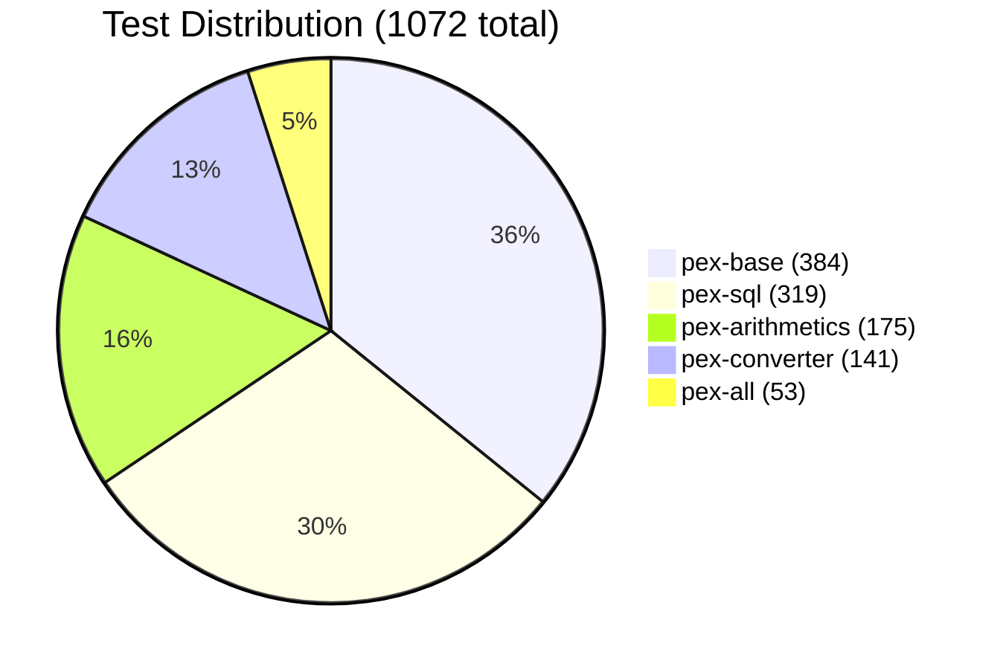

# pex-all

Integration tests module for PEX. Contains cross-module tests that verify all
PEX modules work together correctly -- plugin auto-discovery, end-to-end
pipelines from grammar through execution, and JIT compilation round-trips.

For detailed design documentation see [CODE_OVERVIEW.md](doc/CODE_OVERVIEW.md).

## Dependencies

- `pex-base`
- `pex-arithmetics`
- `pex-converter`
- `pex-sql`

All four modules are included so that `ServiceLoader`-based plugin discovery
finds every registered plugin in a single classpath.

## Test Categories

### Cross-Module Plugin Loading

Tests that `ExecutionEngine.builder().loadPlugins()` discovers and initializes
all plugins (`ArithmeticsPlugin`, `ConverterPlugin`, `SqlPlugin`) via
`ServiceLoader`, respecting load order, and that their handlers and functions
are available in the engine.

### End-to-End Pipelines

Tests that exercise the full pipeline:

1. Define a BNF grammar
2. Parse input text with `RecursiveDescentEngine`
3. Build an AST from the parse result
4. Execute the AST with `ExecutionEngine` (with all plugins loaded)
5. Verify the computed result

These tests cover arithmetic expressions, scoped variables, function calls, and
conditional logic across module boundaries.

### JIT Round-Trip

Tests the complete JIT compilation cycle:

1. Construct an AST (using nodes from `pex-base` and handlers from
   `pex-arithmetics`)
2. Convert the AST to Java source using `pex-converter`'s `JavaConverter`
3. Compile the Java source in-memory with `JitCompiler`
4. Execute the compiled `JitExecutable`
5. Compare the JIT result against direct AST execution to verify equivalence

### SQL Integration

Tests that combine the SQL module with the execution engine, verifying that
SQL parsing, in-memory database execution, and result extraction work end-to-end
when all modules are on the classpath.

## How to Run

### Maven

```bash
# Run only integration tests
mvn test -pl pex-all

# Run from the root (builds all modules first)
mvn verify
```

### Gradle

```bash
# Run only integration tests
./gradlew :pex-all:test

# Run all tests including integration
./gradlew test
```

Both build systems pass `--enable-preview` and run tests in parallel (4 forks).

## Test Distribution Across PEX Modules



## Test Coverage

**53 tests** covering:

- Plugin auto-discovery and initialization ordering
- Multi-plugin handler and function registration
- Grammar composition across plugins
- Arithmetic expression end-to-end (parse, build AST, execute)
- Scoped variable resolution across nested blocks
- Function call dispatch to arithmetic and SQL functions
- Converter output verification for all 7 target languages
- JIT compile-and-execute round-trip with result equivalence checks
- SQL parse-execute-verify pipelines through `InMemoryDatabase`
- Error propagation across module boundaries (Result monad chaining)
