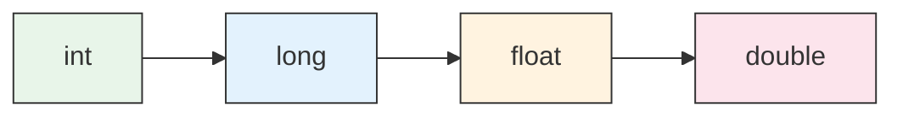
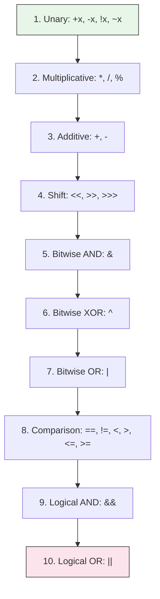

# pex-arithmetics

Arithmetic expression plugin for PEX. Provides numeric operation handlers, math
functions, type conversion functions, radix utilities, and an expression grammar.
Registers everything automatically via the `PexPlugin` SPI.

For detailed design documentation see [CODE_OVERVIEW.md](doc/CODE_OVERVIEW.md).

## Dependencies

- `pex-base`

## Handlers

| Handler | Operations |
|---------|-----------|
| `IntArithmeticHandler` | `+`, `-`, `*`, `/`, `%` for integer types (`int`, `long`) |
| `FloatArithmeticHandler` | `+`, `-`, `*`, `/`, `%` for floating-point types (`float`, `double`) |
| `BitwiseHandler` | `&`, `\|`, `^`, `~`, `<<`, `>>`, `>>>` |
| `BooleanHandler` | `&&`, `\|\|`, `!` |
| `ComparisonHandler` | `==`, `!=`, `<`, `>`, `<=`, `>=` |
| `RadixHandler` | Binary, octal, and hexadecimal literal parsing |

## Functions

### Math Functions (MathFunctions)

| Function | Args | Description |
|----------|------|-------------|
| `abs(x)` | 1 | Absolute value (preserves integer type) |
| `ceil(x)` | 1 | Ceiling |
| `floor(x)` | 1 | Floor |
| `round(x)` | 1 | Rounding (preserves float/double distinction) |
| `sqrt(x)` | 1 | Square root |
| `cbrt(x)` | 1 | Cube root |
| `exp(x)` | 1 | e^x |
| `log(x)` | 1 | Natural logarithm |
| `log10(x)` | 1 | Base-10 logarithm |
| `log2(x)` | 1 | Base-2 logarithm |
| `sin(x)`, `cos(x)`, `tan(x)` | 1 | Trigonometric |
| `asin(x)`, `acos(x)`, `atan(x)` | 1 | Inverse trigonometric |
| `toRadians(x)`, `toDegrees(x)` | 1 | Angle conversion |
| `signum(x)` | 1 | Sign function |
| `pow(x, y)` | 2 | x raised to the power y |
| `max(x, y)` | 2 | Maximum (preserves integer type) |
| `min(x, y)` | 2 | Minimum (preserves integer type) |
| `atan2(y, x)` | 2 | Two-argument arctangent |
| `random()` | 0 | Random double in [0, 1) |
| `PI()` | 0 | Constant pi |
| `E()` | 0 | Constant e |

### Conversion Functions (ConversionFunctions)

Type casting between numeric types: `toInt`, `toLong`, `toFloat`, `toDouble`,
`toString`.

### Radix Functions (RadixFunctions)

Conversion between number bases: `toBinary`, `toOctal`, `toHex`, `fromBinary`,
`fromOctal`, `fromHex`.

## Type Promotion Rules

When operands have mixed types, the result is promoted to the wider type:



| Left | Right | Result |
|------|-------|--------|
| int | int | int |
| int | long | long |
| int | float | float |
| int | double | double |
| long | float | float |
| long | double | double |
| float | double | double |

For `max`, `min`, and `abs`, the original type is preserved when both operands
share the same type.

### Operator Precedence (highest to lowest)



## Plugin Registration

`ArithmeticsPlugin` implements `PexPlugin`, `HandlerProvider`, and
`GrammarProvider`. It registers at load order `100` (early), making its handlers
and functions available to any plugin loaded after it.

```java
// Automatic (via ServiceLoader)
ExecutionEngine.builder().loadPlugins().build();

// Manual
ExecutionEngine.builder()
    .plugin(new ArithmeticsPlugin())
    .build();
```

## Usage Examples

```java
import ssg.pex.arithmetics.ArithmeticsPlugin;
import ssg.pex.exec.ExecutionEngine;

try (var engine = ExecutionEngine.builder()
        .plugin(new ArithmeticsPlugin())
        .build()) {

    // Integer arithmetic
    var add = new BinaryOpNode(lit(10), Operator.PLUS, lit(32), loc);
    engine.execute(add);  // -> 42

    // Float arithmetic
    var div = new BinaryOpNode(lit(22.0), Operator.DIVIDE, lit(7.0), loc);
    engine.execute(div);  // -> 3.142857142857143

    // Bitwise
    var shift = new BinaryOpNode(lit(1), Operator.SHIFT_LEFT, lit(10), loc);
    engine.execute(shift);  // -> 1024

    // Boolean logic
    var and = new BinaryOpNode(lit(true), Operator.AND, lit(false), loc);
    engine.execute(and);  // -> false

    // Comparison
    var gt = new BinaryOpNode(lit(5), Operator.GREATER_THAN, lit(3), loc);
    engine.execute(gt);  // -> true

    // Function calls
    engine.functions().call("sqrt", List.of(144.0), ctx);   // -> 12.0
    engine.functions().call("pow", List.of(2.0, 8.0), ctx); // -> 256.0
    engine.functions().call("abs", List.of(-42), ctx);       // -> 42 (int)
    engine.functions().call("toHex", List.of(255), ctx);     // -> "ff"
}
```

## Test Coverage

**175 tests** covering:

- `IntArithmeticHandler` -- all operators, overflow, division by zero
- `FloatArithmeticHandler` -- all operators, NaN, infinity, precision
- `BitwiseHandler` -- AND, OR, XOR, NOT, shifts
- `BooleanHandler` -- AND, OR, NOT, short-circuit semantics
- `ComparisonHandler` -- all comparisons, mixed types, null handling
- `MathFunctions` -- all 25+ functions, edge cases, arity/type errors
- `ConversionFunctions` -- int/long/float/double/string conversions
- `RadixFunctions` -- binary/octal/hex encode and decode
- `ArithmeticsPlugin` -- handler registration, grammar provision, load order
