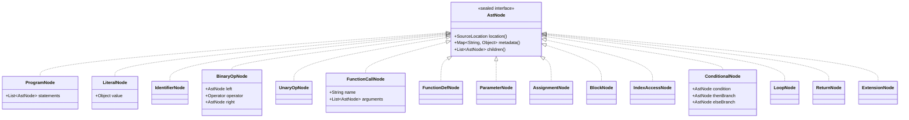
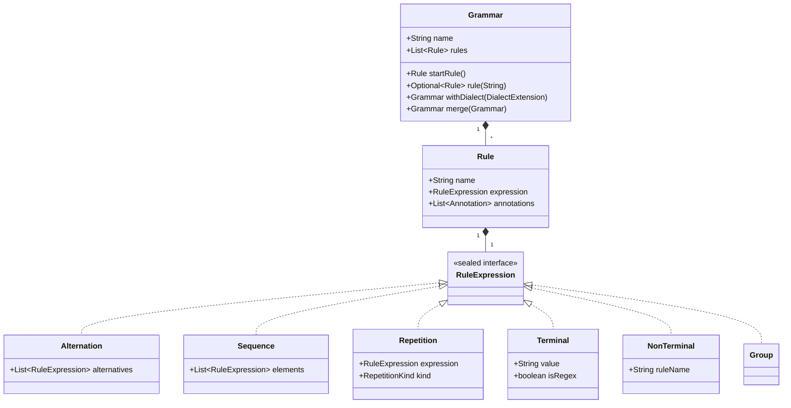
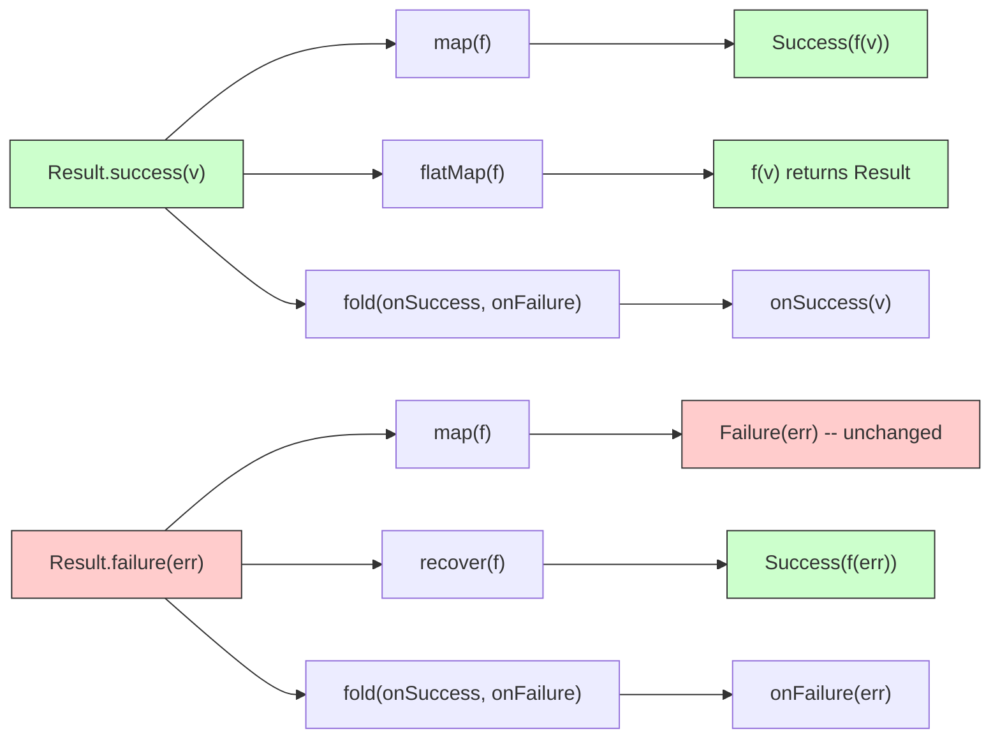

# pex-base

Core foundation module for PEX. Provides BNF grammar parsing, an AST node
hierarchy, a recursive-descent engine, scoped variable management, an execution
engine with pluggable handlers, the `Result<T>` error monad, and the plugin SPI.

For detailed design documentation see [CODE_OVERVIEW.md](doc/CODE_OVERVIEW.md).

## Dependencies

None (only SLF4J API for logging).

## Package Structure

| Package | Contents |
|---------|----------|
| `ssg.pex.result` | `Result<T>` sealed interface, `Success`, `Failure`, `PexError`, `BatchResult` |
| `ssg.pex.bnf.model` | `Grammar`, `Rule`, `RuleExpression` subtypes (`Alternation`, `Sequence`, `Repetition`, `Terminal`, `NonTerminal`, `Group`) |
| `ssg.pex.bnf.parser` | `BnfParser` -- parses BNF/EBNF text into a `Grammar` model |
| `ssg.pex.bnf.engine` | `RecursiveDescentEngine`, `ParseMatch`, `ParseContext` |
| `ssg.pex.bnf.dialect` | `DialectExtension`, `RuleAddition`, `RuleReplacement`, `RuleDeletion`, `RuleExtension` |
| `ssg.pex.ast.node` | `AstNode` sealed interface and 14 node types |
| `ssg.pex.ast` | `SourceLocation` |
| `ssg.pex.scope` | `ScopeTree`, `Scope`, `Variable`, `ScalarVariable`, `ScopeTracer`, `ShadowRecord` |
| `ssg.pex.exec` | `ExecutionEngine`, `ExecutionContext`, `ExecutionConfig`, `HandlerRegistry`, `FunctionRegistry`, `NodeHandler`, `NativeFunction` |
| `ssg.pex.spi` | `PexPlugin`, `PluginContext`, `PluginRegistry`, `HandlerProvider`, `GrammarProvider` |
| `ssg.pex.type` | `PexType` enum, `TypeCoercion`, `TypeDescriptor` |
| `ssg.pex.util` | `Preconditions` |

---

## Diagrams

### AstNode Hierarchy



### BNF Grammar Data Model



### Result\<T\> Monad Flow



---

## Key APIs

### Result\<T\>

A sealed interface (`Success | Failure`) that replaces exceptions as the primary
error-propagation mechanism.

```java
// Create
Result<Integer> ok  = Result.success(42);
Result<Integer> err = Result.failure("DIV_ZERO", "Division by zero");

// Transform
ok.map(n -> n * 2);              // Success(84)
ok.flatMap(n -> divide(100, n)); // chains Results

// Recover
err.recover(e -> 0);             // Success(0)
err.recoverWith(e -> fallback());

// Extract
ok.orElse(0);                    // 42
ok.orElseThrow(e -> new RuntimeException(e.message()));

// Combine
Result.zip(resultA, resultB);    // Result<Pair<A, B>>
Result.sequence(listOfResults);  // Result<List<T>> -- fails on first error
Result.collect(listOfResults);   // BatchResult<T> -- collects all errors

// Fold
ok.fold(v -> "got " + v, e -> "error: " + e.message());
```

### Grammar

An immutable collection of named `Rule` objects with a designated start rule.
Supports dialect extensions (add, replace, delete, extend rules) and grammar
merging.

```java
Grammar grammar = new BnfParser().parse("""
    grammar calc;
    expr   ::= term (( '+' | '-' ) term)* ;
    term   ::= factor (( '*' | '/' ) factor)* ;
    factor ::= /[0-9]+/ | '(' expr ')' ;
    """).value();

grammar.name();          // "calc"
grammar.rules().size();  // 3
grammar.startRule();     // Rule{name='expr', ...}
grammar.rule("term");    // Optional<Rule>

// Dialect extension
Grammar extended = grammar.withDialect(myDialect);
// Merge
Grammar merged = grammar.merge(otherGrammar);
```

### BnfParser

Parses BNF/EBNF text notation into a `Grammar` model. Supports:

- Grammar declaration: `grammar name;`
- Rules: `ruleName ::= expression ;` or `ruleName = expression ;`
- Alternation (`a | b`), sequences (`a b c`), repetition (`a*`, `a+`, `a?`)
- Grouping: `( a b )`
- String terminals: `'literal'` or `"literal"`
- Regex terminals: `/regex/`
- Annotations: `@name` or `@name(value)` before a rule
- Comments: `//` line and `/* */` block

```java
var parser = new BnfParser();
Result<Grammar> result = parser.parse(source);
```

### RecursiveDescentEngine

Interprets a `Grammar` to parse input text into a `ParseMatch` tree. Features
packrat memoization and left-recursion detection.

```java
var engine = new RecursiveDescentEngine();
Result<ParseMatch> result = engine.parse("3 + 5 * 2", grammar);

ParseMatch match = result.value();
match.ruleName();    // "expr"
match.matchedText(); // "3 + 5 * 2"
match.children();    // nested ParseMatch nodes
match.location();    // SourceLocation
```

### AstNode Hierarchy

A sealed interface with 14 permitted implementations:

| Node | Description |
|------|-------------|
| `ProgramNode` | Root node containing a list of statements |
| `LiteralNode` | Literal value (int, float, string, boolean, null) |
| `IdentifierNode` | Variable or name reference |
| `BinaryOpNode` | Binary operation (left, operator, right) |
| `UnaryOpNode` | Unary operation (operator, operand) |
| `FunctionCallNode` | Function invocation with arguments |
| `FunctionDefNode` | Function definition with parameters and body |
| `ParameterNode` | Function parameter |
| `AssignmentNode` | Variable assignment |
| `BlockNode` | Block of statements |
| `IndexAccessNode` | Array/map index access |
| `ConditionalNode` | If-then-else |
| `LoopNode` | While/for loop |
| `ReturnNode` | Return statement |
| `ExtensionNode` | Extension point for plugin-defined nodes |

Every node carries a `SourceLocation` and a `Map<String, Object> metadata()`.

### ScopeTree

Manages a tree of `Scope` objects with variable definition, resolution, update,
and shadowing detection.

```java
var tree = new ScopeTree();

// Define a mutable variable
tree.defineVariable("x", new ScalarVariable("x", 10, true));

// Enter/exit scopes
tree.enterScope("block");
tree.defineVariable("y", new ScalarVariable("y", 20, true));
tree.resolveVariable("x");  // walks up to parent -- finds x=10
tree.exitScope();

// Update
tree.updateVariable("x", 99);  // succeeds (mutable)

// Immutable variables
tree.defineVariable("PI", new ScalarVariable("PI", 3.14, false));
tree.updateVariable("PI", 0);  // Result.failure("IMMUTABLE_VARIABLE", ...)

// Listeners
tree.addListener(new ScopeTreeListener() { ... });

// Shadow tracking
tree.shadowHistory();  // List<ShadowRecord>
```

### ExecutionEngine

Evaluates AST nodes using registered `NodeHandler` implementations and a
`FunctionRegistry`. Built via a fluent `Builder`.

```java
try (var engine = ExecutionEngine.builder()
        .grammar(grammar)
        .config(new ExecutionConfig(512, 50_000, 10_000L, ErrorMode.RESULT))
        .plugin(new ArithmeticsPlugin())
        .addListener(myListener)
        .build()) {

    Result<Object> result = engine.execute(astNode);
    engine.statistics().snapshot(); // node count, errors, timing
}
```

Key builder methods:

| Method | Description |
|--------|-------------|
| `.grammar(g)` | Set the BNF grammar |
| `.config(c)` | Set execution configuration |
| `.plugin(p)` | Add a plugin (handlers + functions + grammar) |
| `.loadPlugins()` | Auto-discover plugins via `ServiceLoader` |
| `.addListener(l)` | Add an `ExecutionListener` |
| `.build()` | Initialize plugins and return the engine |

### PexPlugin SPI

```java
public interface PexPlugin {
    String name();
    default int loadOrder() { return 1000; }
    default void initialize(PluginContext ctx) {}
}
```

`PluginContext` provides:
- `registerHandler(Class<?>, NodeHandler)` -- register a handler for a node type
- `registerFunction(String, List<String>, NativeFunction)` -- register a callable function
- `setGrammar(Grammar)` / `grammar()` -- set or get the grammar

Plugins are discovered via `ServiceLoader` when `loadPlugins()` is called on the
builder, or they can be registered manually with `.plugin(instance)`.

---

## Test Coverage

**384 tests** covering:

- `Result<T>` -- map, flatMap, recover, fold, zip, sequence, collect, error mapping
- `BnfParser` -- grammar declaration, rules, alternation, repetition, terminals, regex, annotations, comments, error cases
- `Grammar` -- rule lookup, start rule, dialect extension (add/replace/delete/extend), merge
- `RecursiveDescentEngine` -- literal matching, regex matching, sequences, alternation, repetition, memoization, left-recursion, error reporting
- `AstNode` -- sealed hierarchy, children, metadata, source locations
- `ScopeTree` -- define, resolve, update, shadowing, immutability, listeners, nested scopes
- `ExecutionEngine` -- handler dispatch, function calls, timeout, statistics, plugin initialization
- `PexPlugin` -- ServiceLoader discovery, load ordering, PluginContext registration
