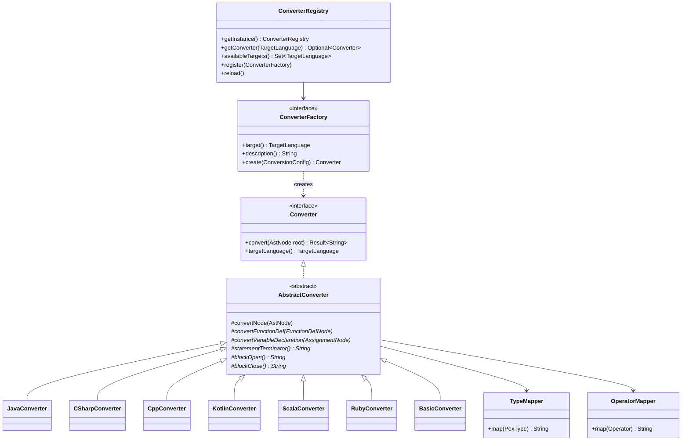

# pex-converter

AST-to-source-code conversion module for PEX. Translates `AstNode` trees into
seven programming languages and provides a JIT compilation pipeline that
compiles generated Java source in-memory and executes it immediately.

For detailed design documentation see [CODE_OVERVIEW.md](doc/CODE_OVERVIEW.md).

## Dependencies

- `pex-base`

## Supported Target Languages

| Enum Value | Language | Extension | Converter Class |
|------------|----------|-----------|-----------------|
| `JAVA` | Java | `.java` | `JavaConverter` |
| `CSHARP` | C# | `.cs` | `CSharpConverter` |
| `CPP` | C++ | `.cpp` | `CppConverter` |
| `KOTLIN` | Kotlin | `.kt` | `KotlinConverter` |
| `SCALA` | Scala | `.scala` | `ScalaConverter` |
| `RUBY` | Ruby | `.rb` | `RubyConverter` |
| `BASIC` | BASIC | `.bas` | `BasicConverter` |
| `JIT` | JIT | `.class` | (via `JitCompiler`) |

All converters extend `AbstractConverter`, which walks the AST and delegates
language-specific decisions (statement terminators, block delimiters, type
mapping, operator mapping, variable declarations, function definitions) to
subclass methods.

## Key APIs

### Converter

```java
public interface Converter {
    Result<String> convert(AstNode root);
    TargetLanguage targetLanguage();
}
```

### ConverterRegistry (SPI)

Singleton registry that discovers `ConverterFactory` implementations via
`ServiceLoader`.

```java
var registry = ConverterRegistry.getInstance();

// List available targets
Set<TargetLanguage> targets = registry.availableTargets();

// Get a converter with default config
Optional<Converter> conv = registry.getConverter(TargetLanguage.JAVA);

// Get a converter with custom config
Optional<Converter> conv = registry.getConverter(TargetLanguage.CPP, config);

// Register a custom factory
registry.register(new MyConverterFactory());

// Reload from ServiceLoader
registry.reload();
```

### ConverterFactory (SPI)

Each language implements this interface for factory-based creation:

```java
public interface ConverterFactory {
    TargetLanguage target();
    String description();
    Converter create(ConversionConfig config);
}
```

### JitCompiler

Compiles Java source code in-memory using `javax.tools.JavaCompiler`, loads the
resulting bytecode via a custom class loader, and returns a `JitExecutable`
instance.

```java
var jit = new JitCompiler();
Result<JitCompilationResult> result = jit.compile(javaSource, "MyClass");

JitCompilationResult compiled = result.value();
compiled.compiledClass();       // Class<?>
compiled.executable();          // JitExecutable
compiled.compilationTimeNanos(); // compilation duration

Object output = compiled.executable().execute();
```

Requirements:
- Must run on a JDK (not JRE) -- needs `javax.tools.JavaCompiler`
- The generated class must implement `JitExecutable`

## Usage Examples

### Convert to Java

```java
var converter = ConverterRegistry.getInstance()
    .getConverter(TargetLanguage.JAVA)
    .orElseThrow();

Result<String> code = converter.convert(ast);
// Object myFunc(Object a, Object b) {
//     var result = a + b;
//     return result;
// }
```

### Convert to C#

```java
var converter = ConverterRegistry.getInstance()
    .getConverter(TargetLanguage.CSHARP)
    .orElseThrow();

Result<String> code = converter.convert(ast);
// object MyFunc(object a, object b) {
//     var result = a + b;
//     return result;
// }
```

### Convert to C++

```java
var converter = ConverterRegistry.getInstance()
    .getConverter(TargetLanguage.CPP)
    .orElseThrow();

Result<String> code = converter.convert(ast);
```

### Convert to Kotlin

```java
var converter = ConverterRegistry.getInstance()
    .getConverter(TargetLanguage.KOTLIN)
    .orElseThrow();

Result<String> code = converter.convert(ast);
// fun myFunc(a: Any, b: Any): Any {
//     val result = a + b
//     return result
// }
```

### Convert to Scala

```java
var converter = ConverterRegistry.getInstance()
    .getConverter(TargetLanguage.SCALA)
    .orElseThrow();

Result<String> code = converter.convert(ast);
```

### Convert to Ruby

```java
var converter = ConverterRegistry.getInstance()
    .getConverter(TargetLanguage.RUBY)
    .orElseThrow();

Result<String> code = converter.convert(ast);
// def my_func(a, b)
//   result = a + b
//   return result
// end
```

### Convert to BASIC

```java
var converter = ConverterRegistry.getInstance()
    .getConverter(TargetLanguage.BASIC)
    .orElseThrow();

Result<String> code = converter.convert(ast);
```

### JIT Round-Trip

```java
// 1. Build an AST
var ast = new BinaryOpNode(lit(6), Operator.MULTIPLY, lit(7), loc);

// 2. Convert to Java source
var javaConverter = ConverterRegistry.getInstance()
    .getConverter(TargetLanguage.JAVA).orElseThrow();
String javaSource = javaConverter.convert(ast).value();

// 3. Compile in-memory
var jit = new JitCompiler();
JitCompilationResult compiled = jit.compile(javaSource, "Expr42").value();

// 4. Execute
Object result = compiled.executable().execute();
// -> 42
```

## Converter Architecture



### JIT Compilation Pipeline

```mermaid
flowchart LR
    AST[AstNode Tree] --> JC[JavaConverter]
    JC --> SRC["Java Source\n(String)"]
    SRC --> JIT[JitCompiler]
    JIT --> MEM["In-Memory\njavax.tools.JavaCompiler"]
    MEM --> BC["Bytecode\n(byte[])"]
    BC --> CL["Custom\nClassLoader"]
    CL --> CLS["Class&lt;?&gt;"]
    CLS --> EXE[JitExecutable]
    EXE --> RES["Result\n(Object)"]

    style AST fill:#e3f2fd,stroke:#333
    style RES fill:#e8f5e9,stroke:#333
    style JIT fill:#fff3e0,stroke:#333
```



## Test Coverage

**141 tests** covering:

- `JavaConverter` -- functions, variables, expressions, conditionals, loops
- `CSharpConverter` -- C#-specific syntax, type mappings
- `CppConverter` -- C++ syntax, pointer types, includes
- `KotlinConverter` -- `val`/`var`, `fun`, `Any` types
- `ScalaConverter` -- `def`, `val`, Scala idioms
- `RubyConverter` -- `def`/`end`, snake_case conversion
- `BasicConverter` -- BASIC syntax, `DIM`, `SUB`/`END SUB`
- `JitCompiler` -- successful compilation, error handling, class loading
- `ConverterRegistry` -- ServiceLoader discovery, factory registration, reload
- `ConversionConfig` -- default and custom configurations
