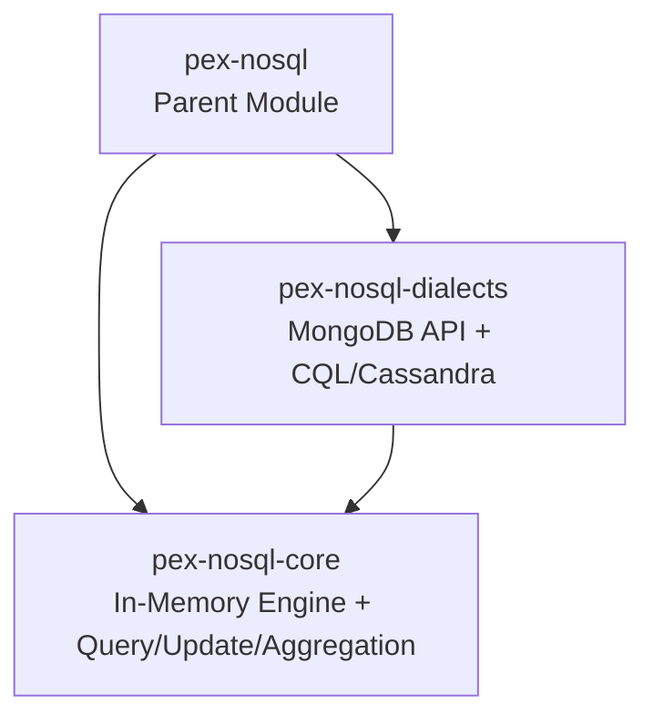

# pex-nosql

Parent module for the PEX NoSQL simulation module family. Provides an in-memory
document store engine and two dialect implementations: MongoDB-style fluent API
and CQL/Cassandra string-based queries.

## Sub-Module Overview

| Sub-Module | Artifact | Description |
|------------|----------|-------------|
| **pex-nosql-core** | `ssg:pex-nosql-core` | In-memory NoSQL engine: `Document` model, `InMemoryCollection` (CRUD + query), `QueryEvaluator` (15 operators), `UpdateEvaluator` (7 operators), `AggregationEngine` (10 pipeline stages) |
| **pex-nosql-dialects** | `ssg:pex-nosql-dialects` | MongoDB fluent API (`MongoCollection`, `MongoQuery`, `MongoUpdate`, `MongoPipeline`) + CQL/Cassandra string dialect (`CassandraSession`, `CassandraDatabase`) |

## Quick Feature Overview

- **MongoDB dialect**: Fluent Java API mirroring the MongoDB driver — `find()`, `insertOne()`, `updateOne()`, `deleteMany()`, aggregation pipelines with `$match`, `$group`, `$sort`, `$project`, `$limit`, `$skip`
- **Cassandra dialect**: CQL string execution — `CREATE TABLE`, `INSERT INTO`, `SELECT ... WHERE`, `DELETE`, `ALLOW FILTERING`, `COUNT(*)`, prepared statements, batch CQL
- **184 tests** across `NoSqlFeatureComplianceTest`, `MongoDbFeatureTest`, `CassandraFeatureTest`, `NoSqlBenchmarkTest`
- **4 EBNF grammar files**: `nosql-query.ebnf`, `nosql-operations.ebnf` (in core), `mongodb.ebnf`, `cassandra.ebnf` (in dialects)
- **SPI plugins**: `NoSqlPlugin` (loadOrder 210) and `NoSqlDialectsPlugin` (loadOrder 240) are discoverable via `ServiceLoader`

## Module Structure



## Dependency

```
pex-nosql-core  → pex-base
pex-nosql-dialects → pex-nosql-core
```
