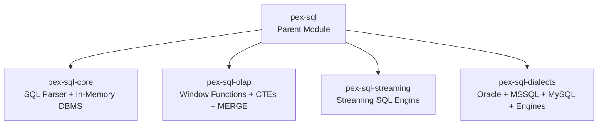
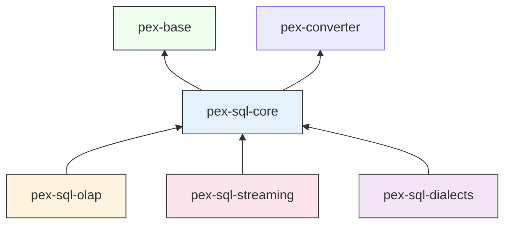

# pex-sql

Parent module for the PEX SQL module family. Provides SQL parsing, an in-memory
DBMS, OLAP analytics, streaming SQL, and multi-dialect support through four
specialized sub-modules.

For detailed design documentation see [CODE_OVERVIEW.md](doc/CODE_OVERVIEW.md).

## Dependencies

- `pex-base`
- `pex-converter`

## Module Structure

## Sub-Module Overview

| Sub-Module | Artifact | Description |
|------------|----------|-------------|
| **pex-sql-core** | `ssg:pex-sql-core` | Hand-written SQL parser, sealed `SqlNode` AST, full in-memory DBMS with schema, DML/DDL, joins, aggregations, transactions, triggers, stored procedures; `executeBatch(Stream)`, hash-join, LRU parse cache, partial predicate push-down |
| **pex-sql-olap** | `ssg:pex-sql-olap` | OLAP extensions: 14 window functions, CTEs (recursive and non-recursive), CUBE/ROLLUP/GROUPING SETS, MERGE, PIVOT/UNPIVOT |
| **pex-sql-streaming** | `ssg:pex-sql-streaming` | Streaming SQL engine with CREATE STREAM, tumbling/hopping/sliding/session windows, watermarks, emit strategies, stream joins |
| **pex-sql-dialects** | `ssg:pex-sql-dialects` | Dialect-specific parsers and executors for Oracle, MSSQL, MySQL plus columnar, time-series, full-text, and spatial engines |

## Dependency Diagram

## Test Coverage

| Sub-Module | Tests |
|------------|------:|
| pex-sql-core | 509 |
| pex-sql-olap | 167 |
| pex-sql-streaming | 160 |
| pex-sql-dialects | 256 |
| **Total** | **1,092** |
