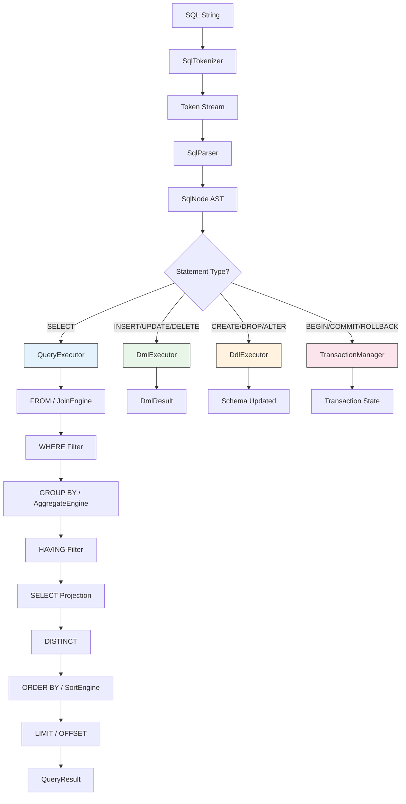
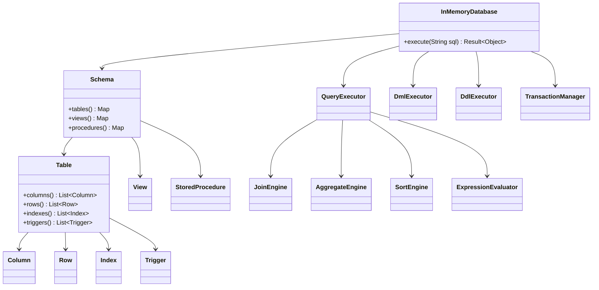

# pex-sql-core

Core SQL module for PEX. Includes a hand-written recursive-descent SQL parser
that produces a sealed `SqlNode` AST, and a full in-memory DBMS with schema
management, DML/DDL execution, joins, aggregations, transactions, triggers, and
stored procedures.

## Dependencies

- `pex-base`
- `pex-converter`

## Extensibility

`InMemoryDatabase` exposes a `protected` constructor `InMemoryDatabase(Schema schema)` and a `protected final Schema defaultSchema` field. Subclasses can inject a custom `Schema` implementation (e.g., for lazy-loading tables from an external store) while inheriting all SQL execution logic.

```java
public class MyDatabase extends InMemoryDatabase {
    public MyDatabase(MySchema schema) {
        super(schema);
    }
}
```

## SQL Parser

`SqlParser` is a hand-written recursive-descent parser that tokenizes SQL via
`SqlTokenizer` and produces a typed `SqlNode` AST. No external parser generator
is used.

### Supported Statements

| Category | Statements |
|----------|-----------|
| **DML** | `SELECT`, `INSERT`, `UPDATE`, `DELETE` |
| **DDL** | `CREATE TABLE`, `DROP TABLE`, `ALTER TABLE`, `CREATE INDEX`, `CREATE VIEW` |
| **Programmability** | `CREATE TRIGGER`, `CREATE PROCEDURE`, `CALL` |
| **Transactions** | `BEGIN`, `COMMIT`, `ROLLBACK`, `SAVEPOINT`, `RELEASE SAVEPOINT` |

### SELECT Capabilities

- `DISTINCT`
- Column expressions, aliases (`AS`), wildcard (`*`, `table.*`)
- `FROM` with multiple tables and aliases
- Joins: `INNER`, `LEFT [OUTER]`, `RIGHT [OUTER]`, `FULL [OUTER]`, `CROSS`
- `WHERE` with full expression support
- `GROUP BY` with `HAVING`
- `ORDER BY` with `ASC`/`DESC` and `NULLS FIRST`/`LAST`
- `LIMIT`/`OFFSET` (including MySQL-style `LIMIT offset, count`)
- Subqueries in `WHERE`, `FROM`, and `SELECT`
- `IN`, `BETWEEN`, `LIKE`/`ILIKE`, `IS [NOT] NULL`, `EXISTS`
- `CASE WHEN ... THEN ... ELSE ... END`
- Aggregate functions: `COUNT`, `SUM`, `AVG`, `MIN`, `MAX`, `GROUP_CONCAT`
- Scalar functions
- Arithmetic and comparison operators with correct precedence

## Diagrams

### SQL Query Execution Pipeline



### DBMS Component Architecture



## Usage Examples

### Create a Table

```java
var db = new InMemoryDatabase();

db.execute("""
    CREATE TABLE employees (
        id      INTEGER PRIMARY KEY AUTO_INCREMENT,
        name    VARCHAR(100) NOT NULL,
        dept_id INTEGER,
        salary  DECIMAL(10,2) DEFAULT 0,
        FOREIGN KEY (dept_id) REFERENCES departments(id)
    )
    """);
```

### Select with Join

```java
Result<Object> result = db.execute("""
    SELECT e.name, d.name AS department, e.salary
    FROM employees e
    INNER JOIN departments d ON e.dept_id = d.id
    WHERE e.salary > 70000
    ORDER BY e.salary DESC
    LIMIT 10
    """);
```

### Transaction with Savepoint

```java
db.execute("BEGIN");
db.execute("UPDATE employees SET salary = salary * 1.1 WHERE dept_id = 1");
db.execute("SAVEPOINT before_delete");
db.execute("DELETE FROM employees WHERE salary < 50000");
db.execute("ROLLBACK TO SAVEPOINT before_delete");
db.execute("COMMIT");
```

## Test Coverage

**319 tests** covering:

- `SqlParser` -- SELECT, INSERT, UPDATE, DELETE, CREATE TABLE, DROP TABLE, ALTER
  TABLE, CREATE INDEX, CREATE VIEW, CREATE TRIGGER, CREATE PROCEDURE, CALL,
  transactions, expression precedence, error cases
- `InMemoryDatabase` -- end-to-end parse + execute for all statement types
- `QueryExecutor` -- projection, filtering, joins (all types), aggregation,
  sorting, limit/offset; streaming cross-join via lazy `flatMap` + predicate
  push-down + early LIMIT (O(result) memory instead of O(n×m))
- `DmlExecutor` -- insert (single, multi-row, subquery), update, delete
- `DdlExecutor` -- create table, drop table, alter table, create index, create
  view
- `JoinEngine` -- inner, left, right, full, cross joins
- `AggregateEngine` -- COUNT, SUM, AVG, MIN, MAX, GROUP_CONCAT, DISTINCT
- `TransactionManager` -- begin, commit, rollback, savepoints, isolation
- `ExpressionEvaluator` -- all SqlExpression types
- `SqlDialects` -- ANSI, MySQL, PostgreSQL keyword sets and features
