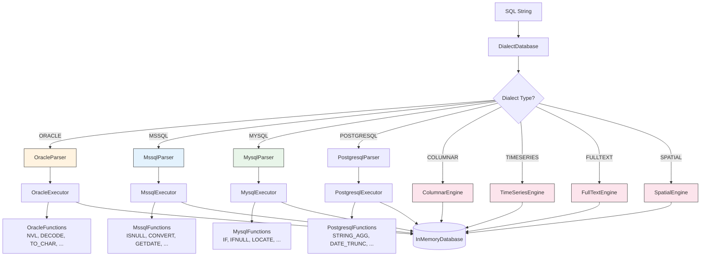
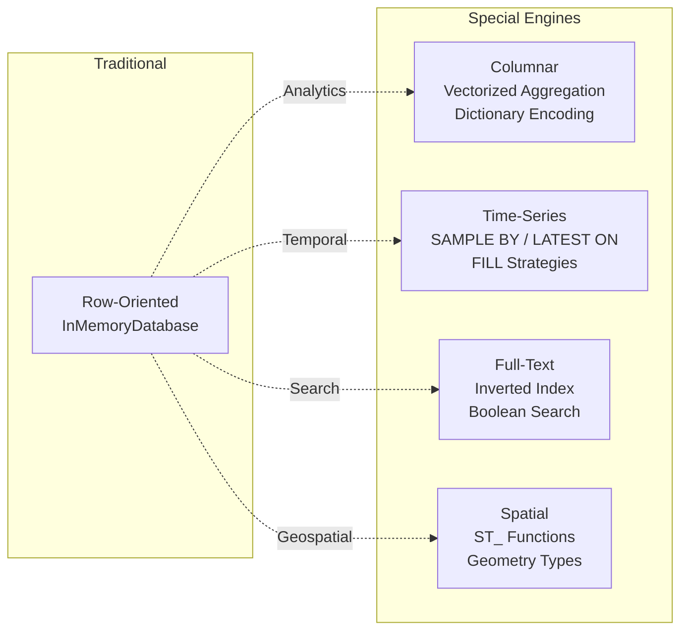

# pex-sql-dialects

Multi-dialect SQL execution module for PEX. Provides dialect-specific parsers,
executors, and function registries for Oracle, MSSQL, MySQL, and PostgreSQL, plus
specialized storage engines for columnar analytics, time-series data, full-text
search, and spatial queries.

## SQL Feature Compliance

A comprehensive compliance test suite covers all 5 dialect variants (CORE, POSTGRESQL, MYSQL, ORACLE, MSSQL):

```bash
mvn test -pl pex-sql/pex-sql-dialects -Dtest=SqlFeatureComplianceTest
```

Test class: `ssg.pex.sql.dialect.SqlFeatureComplianceTest` — 117 tests across 7 nested categories (DDL, DML, SELECT, dialect-specific DML, unsupported features, OLAP aggregates, optimization correctness).

See [docs/COMPLIANCE.md](../../docs/COMPLIANCE.md) at the project root for the full feature support matrix and dialect syntax differences.

## Dependencies

- `pex-sql-core`

## Features

### Dialect Support

| Dialect | Parser | Executor | Functions |
|---------|--------|----------|-----------|
| **Oracle** | `OracleParser` | `OracleExecutor` | NVL, NVL2, DECODE, TO_CHAR, TO_DATE, TO_NUMBER, SYSDATE, MONTHS_BETWEEN, ADD_MONTHS, TRUNC, REGEXP_LIKE, REGEXP_SUBSTR — evaluated via post-processing pass on SELECT results |
| **MSSQL** | `MssqlParser` | `MssqlExecutor` | ISNULL, CONVERT, GETDATE, DATEDIFF, DATEADD, STUFF, CHARINDEX, PATINDEX, FORMAT, NEWID, SCOPE_IDENTITY, @@ROWCOUNT |
| **MySQL** | `MysqlParser` | `MysqlExecutor` | IF, IFNULL, GROUP_CONCAT, LOCATE, INSTR, LPAD, RPAD, FIELD, FIND_IN_SET, DATE_FORMAT, STR_TO_DATE, UNIX_TIMESTAMP, FROM_UNIXTIME |
| **PostgreSQL** | `PostgresqlParser` | `PostgresqlExecutor` | COALESCE, NULLIF, STRING_AGG, ARRAY_AGG, NOW, DATE_TRUNC, EXTRACT, TO_CHAR, TO_TIMESTAMP, GENERATE_SERIES, ARRAY_LENGTH, ARRAY_APPEND, MD5, INITCAP, CONCAT_WS, FORMAT, PG_TYPEOF, LEFT, RIGHT |

### Dialect-Specific SQL Extensions

**Oracle**:
- `CONNECT BY` hierarchical queries with `START WITH`, `PRIOR`, and `LEVEL`
- `ROWNUM` pseudo-column filtering
- Oracle-style outer join (`(+)`)

**MSSQL**:
- `SELECT TOP N` row limiting
- `CROSS APPLY` / `OUTER APPLY` lateral joins
- `OFFSET ... FETCH NEXT` pagination

**MySQL**:
- `REPLACE INTO` -- insert-or-replace semantics
- `ON DUPLICATE KEY UPDATE` -- upsert on insert conflict (pre-checks for duplicate row before inserting, since PEX does not enforce PK uniqueness constraints)
- `LIMIT offset, count` syntax

**PostgreSQL**:
- `ON CONFLICT ... DO UPDATE/NOTHING` -- upsert
- `RETURNING` clause for INSERT/UPDATE/DELETE
- `::` type cast operator (e.g., `price::INT`)
- `ILIKE` -- case-insensitive LIKE
- `DISTINCT ON (columns)` -- PostgreSQL-specific deduplication
- `GENERATE_SERIES(start, stop, step)` -- set-returning function
- `ARRAY[...]` literals and array functions
- `SERIAL` / `BIGSERIAL` column types
- `DO $$ ... $$` anonymous code blocks

### Special Engines

| Engine | Class | Description |
|--------|-------|-------------|
| **Columnar** | `ColumnarEngine` | Column-oriented storage with vectorized aggregation, dictionary encoding, and compression statistics |
| **Time-Series** | `TimeSeriesEngine` | Time-bucketed queries with `SAMPLE BY` intervals, `LATEST ON` partition lookup, and `FILL` strategies (PREV, LINEAR, NULL, constant) |
| **Full-Text** | `FullTextEngine` | Inverted-index text search with `MATCH ... AGAINST`, `CONTAINS`, boolean operators (AND/OR/NOT), scoring, and snippets |
| **Spatial** | `SpatialEngine` | Geospatial queries with `ST_Distance`, `ST_Contains`, `ST_Within`, `ST_Intersects`, `ST_Buffer`, and `ST_Area` on POINT/POLYGON/LINESTRING geometries |

## API

`DialectFunctionRegistry` exposes `functionNames()` returning `Set<String>` of all registered function names for a given dialect. Use it to inspect which functions are available or to detect whether a SQL expression contains a dialect function:

```java
var registry = new DialectFunctionRegistry(DialectType.ORACLE);
Set<String> oracleFunctions = registry.functionNames(); // {NVL, NVL2, DECODE, TO_CHAR, ...}
```

## Diagrams

### Dialect Dispatch Architecture



### Engine Comparison



## Usage Examples

### Oracle -- NVL and CONNECT BY

```java
var db = new DialectDatabase(new InMemoryDatabase(), DialectType.ORACLE);
db.execute("CREATE TABLE emp (id INT, name VARCHAR(50), mgr_id INT)");
db.execute("INSERT INTO emp VALUES (1, 'Boss', NULL)");
db.execute("INSERT INTO emp VALUES (2, 'Alice', 1)");

// NVL function
var reg = db.functionRegistry();
Object result = reg.get("NVL").apply(List.of(null, "default")); // "default"

// CONNECT BY hierarchical query
db.execute("SELECT * FROM emp CONNECT BY PRIOR id = mgr_id START WITH mgr_id IS NULL");
```

### MSSQL -- TOP and ISNULL

```java
var db = new DialectDatabase(new InMemoryDatabase(), DialectType.MSSQL);
db.execute("CREATE TABLE orders (id INT, total INT, discount INT)");
// ... insert data ...

// SELECT TOP
db.execute("SELECT TOP 5 * FROM orders ORDER BY total DESC");

// ISNULL function
var reg = db.functionRegistry();
Object result = reg.get("ISNULL").apply(List.of(null, 0)); // 0
```

### MySQL -- REPLACE INTO and IF

```java
var db = new DialectDatabase(new InMemoryDatabase(), DialectType.MYSQL);
db.execute("CREATE TABLE config (key_name VARCHAR(50) PRIMARY KEY, value VARCHAR(100))");
db.execute("INSERT INTO config VALUES ('timeout', '30')");

// REPLACE INTO (insert or replace)
db.execute("REPLACE INTO config VALUES ('timeout', '60')");

// IF function
var reg = db.functionRegistry();
Object result = reg.get("IF").apply(List.of(true, "yes", "no")); // "yes"
```

### PostgreSQL -- ON CONFLICT and Type Cast

```java
var db = new DialectDatabase(new InMemoryDatabase(), DialectType.POSTGRESQL);
db.execute("CREATE TABLE products (id INT PRIMARY KEY, name VARCHAR(100), price DOUBLE)");
db.execute("INSERT INTO products VALUES (1, 'Widget', 9.99)");

// ON CONFLICT upsert
db.execute("INSERT INTO products VALUES (1, 'Widget', 12.99) ON CONFLICT (id) DO UPDATE SET price = 12.99");

// Type cast with ::
db.execute("SELECT name, price::INT FROM products");

// ILIKE (case-insensitive)
db.execute("SELECT * FROM products WHERE name ILIKE '%widget%'");

// PostgreSQL functions
var reg = db.functionRegistry();
Object result = reg.get("INITCAP").apply(List.of("hello world")); // "Hello World"
```

### Full-Text Search

```java
var db = new DialectDatabase(new InMemoryDatabase(), DialectType.FULLTEXT);
db.execute("CREATE TABLE docs (id INT, title VARCHAR(200), body TEXT)");
// ... insert documents ...

db.execute("SELECT * FROM docs WHERE MATCH(body) AGAINST('java programming')");
```

### Spatial Query

```java
var db = new DialectDatabase(new InMemoryDatabase(), DialectType.SPATIAL);
db.execute("CREATE TABLE places (id INT, name VARCHAR(50), location POINT)");
// ... insert places ...

db.execute("SELECT * FROM places WHERE ST_Distance(location, POINT(40.7, -74.0)) < 10");
```

## Package Structure

| Package | Contents |
|---------|----------|
| `ssg.pex.sql.dialects` | `DialectDatabase`, `DialectFunctionRegistry`, `DialectsPlugin` |
| `ssg.pex.sql.dialects.oracle` | `OracleParser`, `OracleExecutor`, `OracleFunctions`, `OracleNodes` |
| `ssg.pex.sql.dialects.mssql` | `MssqlParser`, `MssqlExecutor`, `MssqlFunctions`, `MssqlNodes` |
| `ssg.pex.sql.dialects.mysql` | `MysqlParser`, `MysqlExecutor`, `MysqlFunctions`, `MysqlNodes` |
| `ssg.pex.sql.dialects.engines` | `ColumnarEngine`, `TimeSeriesEngine`, `FullTextEngine`, `SpatialEngine` |

## Test Coverage

**148 tests** covering:

- OracleDialectTest: CONNECT BY, ROWNUM, NVL, NVL2, DECODE, TO_CHAR, TO_DATE,
  TO_NUMBER, SYSDATE, MONTHS_BETWEEN, ADD_MONTHS, TRUNC, REGEXP_LIKE,
  REGEXP_SUBSTR
- MssqlDialectTest: TOP, CROSS APPLY, OFFSET/FETCH, ISNULL, CONVERT, GETDATE,
  DATEDIFF, DATEADD, STUFF, CHARINDEX, PATINDEX, FORMAT, NEWID
- MysqlDialectTest: REPLACE INTO, ON DUPLICATE KEY UPDATE, IF, IFNULL,
  GROUP_CONCAT, LOCATE, INSTR, LPAD, RPAD, FIELD, FIND_IN_SET, DATE_FORMAT,
  STR_TO_DATE, UNIX_TIMESTAMP, FROM_UNIXTIME
- SpecialEngineTest: columnar aggregation and compression, time-series SAMPLE BY
  and FILL, full-text MATCH/AGAINST with boolean operators and scoring, spatial
  ST_Distance, ST_Contains, ST_Within, ST_Intersects, ST_Buffer, ST_Area
