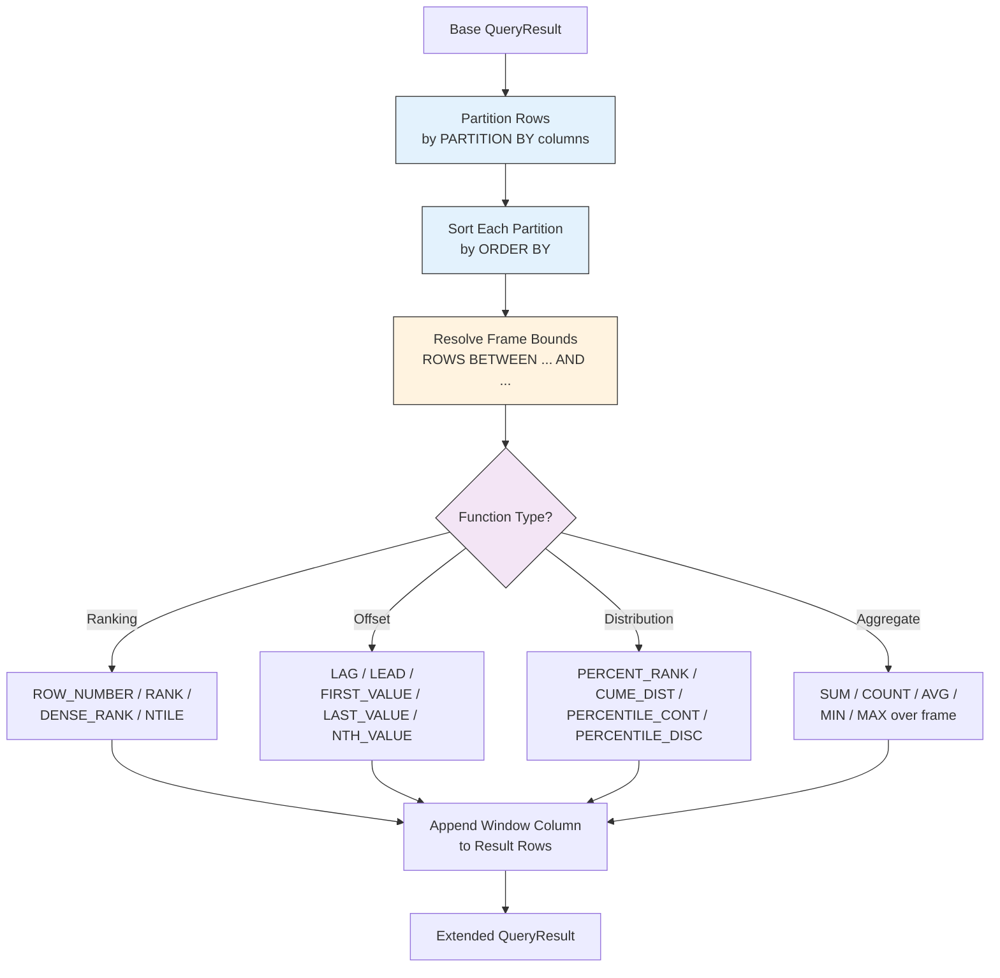
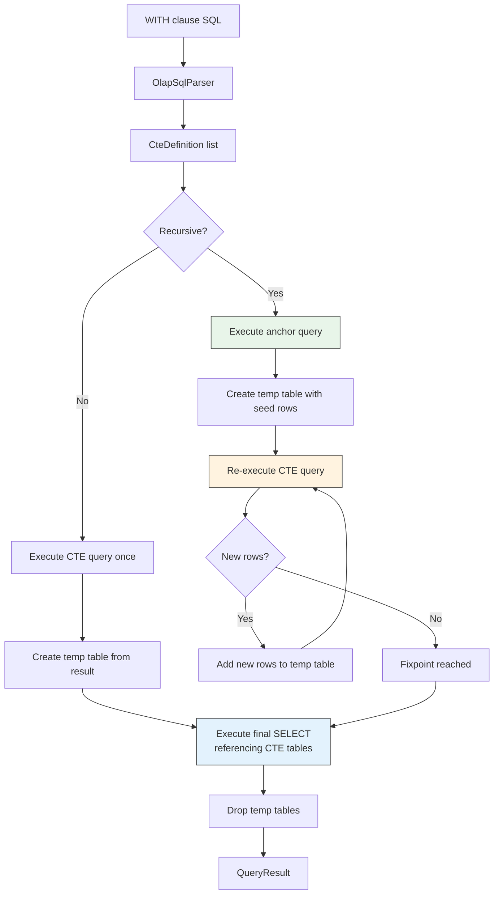

# pex-sql-olap

OLAP (Online Analytical Processing) extension module for PEX SQL. Adds window
functions, Common Table Expressions (CTEs), CUBE/ROLLUP/GROUPING SETS, MERGE
statements, and PIVOT/UNPIVOT operations on top of the core in-memory DBMS.

## Dependencies

- `pex-sql-core`

## Features

### Window Functions (14)

| Category | Functions |
|----------|-----------|
| **Ranking** | `ROW_NUMBER`, `RANK`, `DENSE_RANK`, `NTILE` |
| **Offset** | `LAG`, `LEAD`, `FIRST_VALUE`, `LAST_VALUE`, `NTH_VALUE` |
| **Distribution** | `PERCENT_RANK`, `CUME_DIST`, `PERCENTILE_CONT`, `PERCENTILE_DISC` |
| **Aggregate** | `SUM`, `COUNT`, `AVG`, `MIN`, `MAX` (as window functions with OVER) |

All window functions support:
- `PARTITION BY` for grouping rows
- `ORDER BY` within each partition
- Frame specification: `ROWS BETWEEN` / `RANGE BETWEEN`
  - `UNBOUNDED PRECEDING`, `N PRECEDING`, `CURRENT ROW`, `N FOLLOWING`, `UNBOUNDED FOLLOWING`

### Auto-routing in `executeOlap()`

`OlapDatabase.executeOlap(String sql)` auto-detects and routes to the appropriate executor:
- SQL containing `OVER` → `executeWindowFunctionQuery()` (window functions)
- SQL containing `GROUP BY ... ROLLUP(` or `GROUP BY ... CUBE(` → `executeGroupingSetQuery()`
- All other SQL → core `database.execute()`

This means callers can use a single `executeOlap(sql)` entry point for all OLAP workloads without knowing which sub-executor handles the query.

**DDL/DML correctness**: When the delegated `database.execute()` returns a `DmlResult` (DDL/DML statements), `executeOlap()` returns `Result.success(empty QueryResult)` instead of failure. This prevents bridge wrappers like `OlapMdbDatabase` from seeing a spurious failure and re-executing the same statement.

### Common Table Expressions (CTEs)

- **Non-recursive CTEs**: define named subqueries with `WITH name AS (SELECT ...)`
- **Recursive CTEs**: iterative fixpoint evaluation with `WITH RECURSIVE`
- Multiple CTEs in a single `WITH` clause
- Column aliases: `WITH name(col1, col2) AS (...)`

### CUBE / ROLLUP / GROUPING SETS

- `GROUP BY CUBE(a, b)` -- all combinations of grouping columns
- `GROUP BY ROLLUP(a, b)` -- hierarchical subtotals
- `GROUPING SETS ((a), (b), ())` -- explicit grouping set definitions

### MERGE (Upsert)

- `MERGE INTO target USING source ON condition`
- `WHEN MATCHED THEN UPDATE SET ...`
- `WHEN NOT MATCHED THEN INSERT ...`
- `WHEN MATCHED AND condition THEN DELETE`

### PIVOT / UNPIVOT

- `PIVOT (agg(value) FOR column IN (val1, val2, ...))` -- rows to columns
- `UNPIVOT (value FOR column IN (col1, col2, ...))` -- columns to rows

## Diagrams

### Window Function Execution Flow



### CTE Resolution Flow



## Usage Examples

### Window Function -- ROW_NUMBER

```java
var db = new OlapDatabase();
db.execute("CREATE TABLE employees (id INT, name VARCHAR(50), dept VARCHAR(20), salary INT)");
db.execute("INSERT INTO employees VALUES (1, 'Alice', 'Eng', 90000)");
db.execute("INSERT INTO employees VALUES (2, 'Bob', 'Eng', 85000)");
db.execute("INSERT INTO employees VALUES (3, 'Carol', 'Sales', 70000)");

// Get base result
var baseResult = db.executeOlap("SELECT name, dept, salary FROM employees");

// Apply window function
var wfCall = db.parseWindowFunction(
    "ROW_NUMBER() OVER (PARTITION BY dept ORDER BY salary DESC)");
var result = db.executeWindowFunction(
    "SELECT name, dept, salary FROM employees", List.of(wfCall));
```

### CTE -- Recursive Hierarchy

```java
var db = new OlapDatabase();
db.execute("CREATE TABLE org (id INT, name VARCHAR(50), manager_id INT)");
// ... insert data ...

var result = db.executeOlap("""
    WITH RECURSIVE org_tree(id, name, level) AS (
        SELECT id, name, 1 FROM org WHERE manager_id IS NULL
        UNION ALL
        SELECT o.id, o.name, t.level + 1
        FROM org o JOIN org_tree t ON o.manager_id = t.id
    )
    SELECT * FROM org_tree
    """);
```

### MERGE (Upsert)

```java
var db = new OlapDatabase();
// Setup target and source tables...
var result = db.executeMerge("""
    MERGE INTO target t
    USING source s ON t.id = s.id
    WHEN MATCHED THEN UPDATE SET t.value = s.value
    WHEN NOT MATCHED THEN INSERT (id, value) VALUES (s.id, s.value)
    """);
```

### PIVOT

```java
var db = new OlapDatabase();
db.execute("CREATE TABLE sales (product VARCHAR(20), quarter VARCHAR(5), amount INT)");
// ... insert data ...

var pivot = db.parsePivot("SUM(amount) FOR quarter IN ('Q1', 'Q2', 'Q3', 'Q4')");
var result = db.executePivot("sales", pivot, List.of("product"));
```

## Package Structure

| Package | Contents |
|---------|----------|
| `ssg.pex.sql.olap` | `OlapDatabase`, `OlapPlugin` |
| `ssg.pex.sql.olap.ast` | `OlapNode`, `WindowFunctionCall`, `OverClause`, `FrameSpec`, `FrameBound`, `WithClause`, `CteDefinition`, `GroupingSetSpec`, `MergeNode`, `MergeAction`, `PivotClause`, `UnpivotClause` |
| `ssg.pex.sql.olap.parser` | `OlapSqlParser` |
| `ssg.pex.sql.olap.executor` | `WindowFunctionExecutor`, `CteExecutor`, `GroupingSetExecutor`, `MergeExecutor`, `PivotExecutor` |

## Test Coverage

**139 tests** covering:

- Window functions: all 14 functions with PARTITION BY, ORDER BY, and frame specs
- CTEs: non-recursive single and multi-CTE, recursive with fixpoint
- CUBE/ROLLUP/GROUPING SETS: all grouping types with aggregate computation
- MERGE: matched update, not-matched insert, conditional delete
- PIVOT/UNPIVOT: row-to-column and column-to-row transformations
- OlapSqlParser: parsing all OLAP statement types
- Edge cases: empty partitions, null handling, single-row partitions
