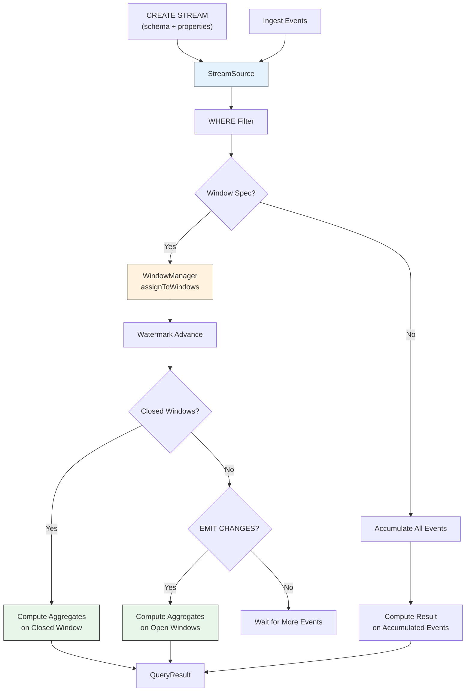

# pex-sql-streaming

Streaming SQL engine for PEX. Provides a SQL-like interface for creating streams,
ingesting events, windowed aggregation, continuous queries, watermarks, emit
strategies, and stream-to-stream / stream-to-table joins.

## Dependencies

- `pex-sql-core`

## Features

### Stream Management

- `CREATE STREAM name (columns...) WITH (properties...)` -- define a named stream
  with a schema and optional properties (e.g., timestamp column, key column)
- `DROP STREAM [IF EXISTS] name` -- remove a stream and its active queries
- `INSERT INTO stream SELECT ... FROM stream` -- register a continuous query

### Window Types

| Window Type | Description | Parameters |
|-------------|-------------|------------|
| **Tumbling** | Fixed-size, non-overlapping time intervals | `durationMs` |
| **Hopping** | Fixed-size windows that advance by a smaller interval | `durationMs`, `advanceMs` |
| **Sliding** | Per-event window covering a trailing time range | `durationMs` |
| **Session** | Gap-based windows that close after inactivity | `gapMs` |

### Event Processing

- `StreamEvent` record: `(timestamp, key, Map<String, Object> values)`
- Events are ingested into `StreamSource` objects and routed to registered queries
- WHERE-clause filtering on stream events
- Aggregate computation: COUNT, SUM, AVG, MIN, MAX, GROUP_CONCAT

### Watermarks

- Monotonically advancing watermark per registered query
- Determines when windows close (window end <= watermark)
- Supports late-event handling

### Emit Strategies

- `EMIT FINAL` -- produce results only when a window closes
- `EMIT CHANGES` -- produce results for both open and closed windows

### Stream Joins

- **Stream-to-stream join**: match events from two streams on a key column
  within a time window
- **Stream-to-table (lookup) join**: enrich stream events by looking up rows
  in a static table

## Diagrams

### Streaming Pipeline



### Window Types Comparison

```mermaid
gantt
    title Window Types (time axis)
    dateFormat X
    axisFormat %s

    section Tumbling
    Window 1 :t1, 0, 10
    Window 2 :t2, 10, 20
    Window 3 :t3, 20, 30

    section Hopping (size=10, advance=5)
    Window A :h1, 0, 10
    Window B :h2, 5, 15
    Window C :h3, 10, 20

    section Session (gap=5)
    Session 1 :s1, 0, 8
    Session 2 :s2, 15, 22
```



## Usage Examples

### Create a Stream and Ingest Events

```java
var sim = new StreamSimulator();

var result = sim.executeQuery("""
    CREATE STREAM clicks (
        user_id VARCHAR(50),
        page VARCHAR(100),
        ts BIGINT
    ) WITH ('timestamp'='ts')
    """);

// Ingest events
sim.ingestEvent("clicks", new StreamEvent(1000L, "user1",
    Map.of("user_id", "user1", "page", "/home", "ts", 1000L)));
sim.ingestEvent("clicks", new StreamEvent(2000L, "user1",
    Map.of("user_id", "user1", "page", "/products", "ts", 2000L)));
```

### Windowed Aggregation

```java
var sim = new StreamSimulator();
// Create stream and ingest events...

// Register a tumbling window query
var query = new StreamSelectNode(
    List.of(
        new SelectItem("COUNT(*)", null, false, false),
        new SelectItem("page", null, false, false)
    ),
    "clicks",
    new WindowSpec(WindowType.TUMBLING, 5000, 0, 0),
    null,
    new GroupByClause(List.of("page")),
    EmitStrategy.FINAL,
    SourceLocation.UNKNOWN
);
sim.registerQuery(query);

// Process events and get windowed results
List<QueryResult> results = sim.processEvents();
```

### Stream-to-Stream Join

```java
var sim = new StreamSimulator();
// Create two streams: orders and payments
// Ingest events into both...

// Join on order_id within a 10-second window
List<StreamEvent> matched = sim.joinStreams("orders", "payments", "order_id", 10000);
```

### One-Shot Query on Stream State

```java
var result = sim.executeQuery(
    "SELECT user_id, COUNT(*) AS cnt FROM clicks " +
    "WINDOW TUMBLING SIZE 5000 GROUP BY user_id EMIT FINAL");
```

## Package Structure

| Package | Contents |
|---------|----------|
| `ssg.pex.sql.streaming` | `StreamingPlugin` |
| `ssg.pex.sql.streaming.ast` | `StreamNode` (sealed), `CreateStreamNode`, `DropStreamNode`, `StreamSelectNode`, `InsertIntoStreamNode`, `WindowSpec`, `EmitStrategy` |
| `ssg.pex.sql.streaming.engine` | `StreamSimulator`, `StreamSource`, `StreamEvent`, `WindowManager`, `Window`, `TumblingWindow`, `HoppingWindow`, `SlidingWindow`, `SessionWindow`, `Watermark`, `StreamSqlParser`, `StreamAggregator` |

## Test Coverage

**140 tests** covering:

- StreamSqlParser: CREATE STREAM, DROP STREAM, SELECT with windows, INSERT INTO
- StreamSimulator: stream lifecycle, event ingestion, one-shot queries
- WindowManager: tumbling, hopping, sliding, session window assignment and closing
- TumblingWindow / HoppingWindow / SlidingWindow / SessionWindow: event assignment,
  boundary conditions, merge logic
- StreamAggregator: COUNT, SUM, AVG, MIN, MAX over windowed events
- Watermark: monotonic advancement, window closure triggering
- Emit strategies: FINAL vs CHANGES behavior
- Stream joins: stream-to-stream within time window, stream-to-table lookup
- Filtering: WHERE clause on stream events
- Edge cases: empty streams, single-event windows, session merging
