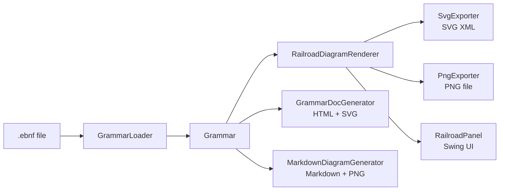
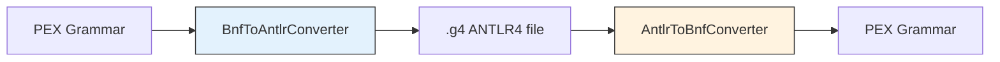

# pex-tools

Grammar visualization, conversion, and documentation generation tools for PEX.

For detailed design documentation see [CODE_OVERVIEW.md](doc/CODE_OVERVIEW.md).

## Dependencies

- `pex-base`

## Features

### Railroad Diagram Visualizer (`ssg.pex.tools.visualizer`)

- **RailroadDiagramRenderer** -- Java2D-based renderer that pattern-matches on the
  sealed `RuleExpression` hierarchy to produce railroad/syntax diagrams:
  - Terminal (literal) -> rounded rectangle
  - Terminal (regex) -> dashed rectangle
  - NonTerminal -> rectangle with solid border
  - Sequence -> horizontal arrow chain
  - Alternation -> vertical branching with curved connectors
  - Repetition -> loop-back arrows (zero-or-more, one-or-more, optional)
  - Group -> delegate to inner expression
- **SvgExporter** -- renders diagrams as native SVG elements (rect, line, text,
  path, polygon) with no raster embedding
- **PngExporter** -- renders to BufferedImage + ImageIO for PNG output
- **RailroadPanel** -- Swing JPanel for embedding in applications
- **GrammarVisualizerApp** -- standalone Swing application with file browser,
  rule list, and diagram viewer
- **DiagramStyle** -- configurable styling (colors, fonts, spacing, corner radius)

### Native ANTLR4 Visualization (`ssg.pex.tools.converter.antlr` + `ssg.pex.tools.visualizer`)

- **AntlrExpression** -- sealed interface with 15 record types preserving ALL ANTLR4
  constructs: Literal, CharClass, RuleRef, TokenRef, Seq, Alt, ZeroOrMore, OneOrMore,
  Optional, Group, Negation, Predicate, Action, Dot, LabeledElement
- **AntlrRule** -- record with name, body, kind (PARSER/LEXER/FRAGMENT), altLabels, commands
- **AntlrGrammar** -- complete grammar model with rules, options, imports, and modes
- **AntlrGrammarParser** -- recursive-descent parser from token stream to native model
- **AntlrDiagramRenderer** -- railroad renderer for all ANTLR constructs with ANTLR-specific
  visual styles (grey/muted for predicates, actions, negation; green for token refs)
- **AntlrMultiRulePanel** -- Swing panel for rendering multiple ANTLR rules

### Grammar Converter (`ssg.pex.tools.converter`)

- **BnfToAntlrConverter** -- converts PEX Grammar to ANTLR4 `.g4` format
  - Terminal literals -> `'...'`, regex -> lexer rules
  - Alternation -> `|`, repetition -> `*/+/?`, groups -> `(...)`
- **AntlrToBnfConverter** -- converts ANTLR4 `.g4` text to PEX Grammar
  - Parser rules -> PEX Rules, lexer rules -> Terminal.regex
  - Emits warnings for unsupported features (actions, predicates, modes)
- **Antlr4Lexer** -- tokenizer for ANTLR4 grammar files
- **ConversionResult** -- holds output + conversion warnings

### Grammar Documentation Generator (`ssg.pex.tools.docgen`)

- **GrammarDocGenerator** -- generates HTML documentation with inline SVG
  railroad diagrams (Oracle SQL Reference style), table of contents, and
  cross-linked NonTerminal references
- **MarkdownDiagramGenerator** -- generates Markdown with embedded PNG images

## Diagrams

### Visualization Pipeline



### Conversion Pipeline



## Usage Examples

### Railroad Diagram to SVG

```java
import ssg.pex.bnf.loader.GrammarLoader;
import ssg.pex.tools.visualizer.DiagramStyle;
import ssg.pex.tools.visualizer.SvgExporter;

var grammar = new GrammarLoader().loadFromFile(Path.of("grammar/arithmetic.ebnf")).value();
var exporter = new SvgExporter();
var style = DiagramStyle.defaultStyle();

// Export single rule
String svg = exporter.exportRule(grammar.rules().get("expr"), style).value();

// Export entire grammar
String allSvg = exporter.exportGrammar(grammar, style).value();
```

### BNF to ANTLR Conversion

```java
import ssg.pex.tools.converter.BnfToAntlrConverter;

var converter = new BnfToAntlrConverter();
var result = converter.convert(grammar);
String antlrSource = result.value().textOutput();
// -> grammar Arithmetic;
//    expr : term (('+' | '-') term)* ;
//    term : factor (('*' | '/') factor)* ;
//    ...
```

### Generate HTML Documentation

```java
import ssg.pex.tools.docgen.GrammarDocGenerator;

var docGen = new GrammarDocGenerator();
String html = docGen.generateHtml(grammar, DiagramStyle.defaultStyle()).value();
// -> Full HTML page with SVG railroad diagrams per rule
```

### Launch Visualizer App

```bash
java --enable-preview -cp "pex-tools.jar:pex-base.jar:slf4j-api.jar" \
    ssg.pex.tools.visualizer.GrammarVisualizerApp
```

## Tests

| Test Class | Tests | Focus |
|-----------|------:|-------|
| RailroadDiagramRendererTest | 21 | BNF measure/render for all expression types |
| AntlrDiagramRendererTest | 59 | ANTLR measure/render for all 15 expression types, rules, panel |
| AntlrGrammarParserTest | 35 | ANTLR parsing: all rule kinds, expressions, labels, modes |
| GrammarVisualizerAppTest | 41 | Load, drag-drop, multi-select, clipboard, ANTLR support |
| MultiRulePanelTest | 13 | BNF multi-rule panel rendering |
| SvgExporterTest | 5 | SVG element verification, XML validity |
| PngExporterTest | 5 | File creation, image validity, batch export |
| BnfToAntlrConverterTest | 13 | BNF->ANTLR mapping, round-trip |
| AntlrToBnfConverterTest | 14 | ANTLR->BNF, warnings, error handling |
| Antlr4LexerTest | 9 | Tokenization, comments, action blocks, new token types |
| GrammarDocGeneratorTest | 6 | HTML generation, TOC, SVG embedding |
| **Total** | **221** | |
